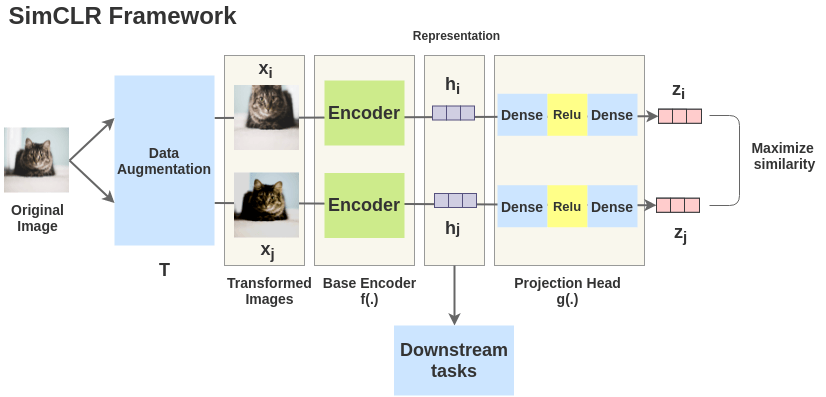
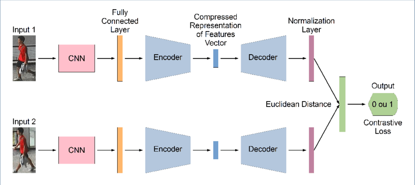

# Computer Vision — Interview Notes

---

## Table of Contents

1. [Generative Models (AE / VAE / GAN)](#1-generative-models)
2. [CNN Fundamentals](#2-cnn-fundamentals)
3. [CNN Advanced Concepts](#3-cnn-advanced-concepts)

---

## 1. Generative Models

Autoencoders (AE), Variational Autoencoders (VAE), and Generative Adversarial Networks (GAN) are all types of neural network architectures used for **unsupervised learning**, particularly for tasks involving data generation and representation learning. The diagrams below illustrate related self-supervised / contrastive representation learning.

`image1.png`

`image2.png`

### 1.1 Autoencoders (AE)

**Architecture**

- Consist of an encoder and a decoder.
- The encoder maps the input data to a lower-dimensional latent space.
- The decoder reconstructs the original data from the latent representation.

**Objective**

- Minimize the reconstruction error, typically measured by Mean Squared Error (MSE) or Binary Cross-Entropy.

**Applications**

- Dimensionality reduction.
- Data denoising.
- Feature learning.
- Anomaly detection.

**Strengths**

- Simple and effective for reconstruction tasks.
- Can be used for compressing data.

**Limitations**

- May not generate new data samples that are as realistic as those produced by VAEs or GANs.
- Can suffer from overfitting if not regularized properly.

### 1.2 Variational Autoencoders (VAE)

**Architecture**

- Similar to autoencoders but with a probabilistic approach.
- The encoder outputs parameters of a probability distribution (mean and variance) instead of a single point.
- During training, latent variables are sampled from this distribution.
- The decoder reconstructs the data from the sampled latent variables.

**Objective**

- Minimize a combination of the reconstruction loss and the Kullback-Leibler (KL) divergence, which regularizes the latent space to follow a standard normal distribution.

**Applications**

- Similar to autoencoders but also include generating new, realistic samples.
- Anomaly detection.
- Semi-supervised learning.

**Strengths**

- Can generate new data samples by sampling from the latent space.
- Regularizes the latent space, making it smooth and continuous, which improves the quality of generated samples.

**Limitations**

- Training can be more complex due to the KL divergence term.
- Generated samples might still be of lower quality compared to GANs.

### 1.3 Generative Adversarial Networks (GAN)

**Architecture**

- Consist of two networks: a generator and a discriminator.
- The generator creates fake data samples from random noise.
- The discriminator attempts to distinguish between real and fake samples.
- Both networks are trained simultaneously in a minimax game.

**Objective**

- The generator aims to minimize the discriminator's ability to correctly classify real vs. fake samples.
- The discriminator aims to maximize its classification accuracy.

**Applications**

- High-quality data generation (images, text, etc.).
- Image-to-image translation.
- Super-resolution.
- Style transfer.

**Strengths**

- Capable of generating highly realistic data samples.
- Versatile and widely used in various applications involving data generation.

**Limitations**

- Training can be unstable and difficult to converge.
- Susceptible to mode collapse, where the generator produces a limited variety of samples.
- Requires careful tuning of hyperparameters.

### 1.4 Summary

- **Autoencoders** are simple and effective for reconstruction tasks and dimensionality reduction but may not produce realistic new samples.
- **Variational Autoencoders (VAE)** introduce a probabilistic approach to improve sample generation quality and regularize the latent space, though the generated samples might not be as realistic as those from GANs.
- **Generative Adversarial Networks (GAN)** are powerful for generating highly realistic samples, but they are challenging to train and can suffer from issues like mode collapse.

Each of these architectures has its strengths and weaknesses, making them suitable for different applications and scenarios in unsupervised learning and data generation.

---

## 2. CNN Fundamentals

### 2.1 What is a Convolutional Neural Network (CNN)?

*Can you explain what a Convolutional Neural Network (CNN) is and how it differs from a regular neural network?*

A Convolutional Neural Network (CNN) is a specialized type of neural network designed for processing structured grid data like images. Unlike regular neural networks, CNNs use a mathematical operation called convolution to extract spatial features from the input data. CNNs consist of layers such as convolutional layers, pooling layers, and fully connected layers. These layers help in detecting patterns and features in images, making CNNs particularly effective for tasks like image classification, object detection, and image segmentation.

### 2.2 Purpose of the Convolutional Layer

*What role does the convolutional layer play in a CNN, and how does it work?*

The convolutional layer is the core building block of a CNN. It applies a set of filters (also called kernels) to the input image to create feature maps. Each filter slides (convolves) over the input image and performs element-wise multiplication and summation to produce a single value at each position. The purpose of the convolutional layer is to detect various features in the input data, such as edges, textures, and shapes, by learning different filters during the training process.

### 2.3 Pooling

*Can you explain what pooling is in the context of CNNs and why it is important?*

Pooling, also known as subsampling or downsampling, is a technique used in CNNs to reduce the spatial dimensions (width and height) of the feature maps while retaining important information. The most common types of pooling are max pooling and average pooling. Max pooling selects the maximum value from each patch of the feature map, while average pooling calculates the average value. Pooling is important because it helps reduce the computational complexity, prevents overfitting, and makes the network more invariant to small translations in the input image.

### 2.4 Activation Functions

*Why are activation functions used in CNNs, and which ones are commonly used?*

Activation functions introduce non-linearity into the network, allowing it to learn complex patterns and representations in the data. Without non-linear activation functions, a neural network would behave like a linear model, limiting its capability to model complex relationships. Commonly used activation functions in CNNs include ReLU (Rectified Linear Unit), which sets all negative values to zero, and its variants like Leaky ReLU and Parametric ReLU, which allow a small gradient for negative values. Sigmoid and tanh are also used, though less frequently in modern architectures due to issues like vanishing gradients.

### 2.5 Common CNN Architectures

*Can you name and briefly describe some popular CNN architectures?*

Some popular CNN architectures include:

- **LeNet-5**: One of the earliest CNN architectures, designed for handwritten digit recognition (MNIST dataset). It consists of two convolutional layers followed by two fully connected layers.
- **AlexNet**: Won the 2012 ImageNet competition. It has five convolutional layers, some followed by max pooling layers, and three fully connected layers. It introduced the use of ReLU activation and dropout for regularization.
- **VGGNet**: Known for its simplicity, using only 3x3 convolutional filters and increasing depth by stacking more layers. VGG16 and VGG19 are common variants with 16 and 19 weight layers, respectively.
- **GoogLeNet (Inception)**: Introduced the Inception module, which applies multiple filters of different sizes in parallel and concatenates their outputs. GoogLeNet has a deeper architecture with 22 layers.
- **ResNet**: Introduced residual learning with skip connections, allowing the network to be significantly deeper (e.g., ResNet-50, ResNet-101) by addressing the vanishing gradient problem.

### 2.6 Receptive Field

*What do you understand by the term 'receptive field' in the context of CNNs?*

The receptive field in a CNN refers to the region of the input image that influences a particular activation in a feature map. It represents the spatial extent of the input that a particular convolutional layer's neuron is sensitive to. As we go deeper into the network, the receptive field increases, allowing neurons in higher layers to capture more global and complex features of the input image.

### 2.7 Filters / Kernels

*Can you explain what a filter (or kernel) is in the context of CNNs and its purpose?*

A filter or kernel in a CNN is a small matrix of weights used to scan the input image or feature map. During the convolution operation, the filter slides over the input, performing element-wise multiplication and summation at each position to produce a feature map. Each filter detects different features, such as edges, textures, or patterns, by learning the optimal weights during the training process. Multiple filters are used in each convolutional layer to capture a diverse set of features from the input data.

---

## 3. CNN Advanced Concepts

### 3.1 Padding

*What is padding in the context of CNNs, and what are its benefits?*

Padding in CNNs involves adding extra pixels around the border of the input image before applying the convolution operation. The primary types of padding are "valid" (no padding) and "same" (padding such that the output size is the same as the input size). Padding is used for several reasons:

- It helps preserve the spatial dimensions of the input, allowing deeper networks without reducing the feature map size too quickly.
- It enables the use of convolutions at the edges of the input, ensuring that all pixels in the original image contribute to the output.
- It can help maintain information at the boundaries of the image, which might otherwise be lost during convolution.

### 3.2 Stride

*Can you explain what stride is in CNNs and how it influences the output feature maps?*

Stride in CNNs refers to the number of pixels by which the filter or kernel moves (or "strides") across the input image during the convolution operation. A stride of 1 means the filter moves one pixel at a time, while a stride of 2 means it moves two pixels at a time, and so on. Stride affects the size of the output feature maps as follows:

- Increasing the stride reduces the spatial dimensions of the output feature map, as fewer positions are sampled.
- A larger stride can lead to faster computations and reduced memory usage but might result in a loss of spatial resolution and detail.
- The output size can be calculated using the formula:

$$\text{Output size} = \left\lfloor \frac{\text{Input size} - \text{Filter size}}{\text{Stride}} \right\rfloor + 1$$

### 3.3 Dilated Convolutions

*What are dilated convolutions, and what advantages do they offer over standard convolutions?*

Dilated convolutions, also known as atrous convolutions, introduce spaces between the filter weights by skipping certain pixels. This is controlled by a dilation rate parameter, which defines the spacing between the weights. For a dilation rate of 1, the dilated convolution is equivalent to a standard convolution. Higher dilation rates spread the filter weights further apart, allowing the network to have a larger receptive field without increasing the number of parameters. The advantages of dilated convolutions include:

- They enable capturing more contextual information at various scales.
- They are particularly useful in tasks like semantic segmentation where capturing multi-scale context is crucial.
- They help preserve spatial resolution while expanding the receptive field.

### 3.4 Batch Normalization vs Layer Normalization

*Can you compare Batch Normalization and Layer Normalization and their roles in CNNs?*

Both Batch Normalization and Layer Normalization are techniques used to normalize the activations of neurons to improve training stability and performance, but they operate differently:

- **Batch Normalization**: Normalizes the inputs of each layer across the mini-batch. It calculates the mean and variance for each feature over the mini-batch and then normalizes the data. Batch Normalization helps reduce internal covariate shift, accelerates training, and acts as a regularizer. However, it depends on the mini-batch size, which can cause issues with small batch sizes or in certain tasks like recurrent neural networks.
- **Layer Normalization**: Normalizes the inputs across the features for each individual data point (sample). It computes the mean and variance for each sample and then normalizes the data. Layer Normalization is independent of the mini-batch size, making it more suitable for tasks with variable-length inputs or small batch sizes.

### 3.5 Residual Blocks (ResNet)

*Explain the concept of a residual block in ResNet architectures and its importance.*

The residual block is a key component of ResNet (Residual Networks) architectures, designed to address the problem of vanishing/exploding gradients in very deep networks. A residual block consists of a few convolutional layers with an identity shortcut connection that skips one or more layers. The output of the residual block is the sum of the input to the block and the output of the convolutional layers:

$$\mathbf{y} = \mathcal{F}(\mathbf{x}, \{W_i\}) + \mathbf{x}$$

where $\mathbf{x}$ is the input, $\mathcal{F}$ represents the convolutional layers, and $W_i$ are the weights. The importance of the residual block includes:

- It allows gradients to flow more easily through the network, enabling the training of much deeper networks.
- It mitigates the degradation problem, where adding more layers leads to higher training error.
- It encourages feature reuse and model generalization by allowing the network to learn residual functions instead of direct mappings.

### 3.6 Transfer Learning

*What is transfer learning in CNNs, and how is it typically applied?*

Transfer learning involves leveraging pre-trained CNN models on large datasets (such as ImageNet) for tasks on different but related datasets. Instead of training a CNN from scratch, transfer learning adapts a pre-trained model to a new task by:

- **Fine-tuning**: Retraining some or all of the layers of the pre-trained model on the new dataset. This can involve retraining the entire network or only a few top layers.
- **Feature extraction**: Using the pre-trained model as a fixed feature extractor. The pre-trained network's convolutional layers are used to extract features from the new dataset, and only the final classification layer is trained.

Transfer learning is advantageous because it:

- Reduces the computational resources and time required for training.
- Improves performance, especially when the new dataset is small or lacks diversity.
- Benefits from the learned representations and features from the pre-trained model, which are often generalizable across different tasks.
