# ML / DL Interview Preparation Notes

---

## Table of Contents

1. [Mathematical Foundations](#1-mathematical-foundations)
2. [Statistical Inference](#2-statistical-inference)
3. [Core ML Concepts](#3-core-ml-concepts)
4. [Feature Engineering & Data](#4-feature-engineering--data)
5. [Classical ML Models](#5-classical-ml-models)
6. [Ensemble Methods](#6-ensemble-methods)
7. [Regularization & Loss Functions](#7-regularization--loss-functions)
8. [Optimization](#8-optimization)
9. [Neural Network Fundamentals](#9-neural-network-fundamentals)
10. [Dimensionality Reduction](#10-dimensionality-reduction)
11. [Sequential Models](#11-sequential-models)
12. [NLP & Transformers](#12-nlp--transformers)
13. [Advanced Topics](#13-advanced-topics)
14. [Amazon Applied Scientist Interview Topics](#14-amazon-applied-scientist-interview-topics)
15. [References](#references)

---

## 1. Mathematical Foundations

### 1.1 Data Types

| Type | Description | Examples |
|:---|:---|:---|
| **Nominal** | Categorical, no order | Colors, gender, country |
| **Ordinal** | Categorical, with order | Movie ratings, satisfaction (1-5) |
| **Interval** | Numeric, no true zero; differences meaningful | Temperature (°C), IQ scores |
| **Ratio** | Interval + true zero; ratios meaningful | Height, weight, income |

**Variable Roles:**

| Type | Description | Example |
|:---|:---|:---|
| **Dependent Variable** | Outcome variable being measured; depends on the independent variable | Exam score |
| **Independent Variable** | Predictor/experimental variable being manipulated or controlled | Study hours |
| **Dichotomous Variable** | A nominal variable with exactly two categories | Yes/No, Pass/Fail |

---

### 1.2 Mean, Variance & Standard Deviation

- **Mean ($\mu$ or $\bar{x}$)** — the average value; the "center" of the data.
- **Variance ($\sigma^2$)** — average squared deviation from the mean; measures spread, in squared units.
- **Standard deviation ($\sigma$)** — $\sqrt{\text{variance}}$; measures spread in the *original* units (easier to interpret than variance).

$$\bar{x} = \frac{1}{N}\sum_{i=1}^{N} x_i \qquad \sigma^2 = \frac{1}{N}\sum_{i=1}^{N} (x_i - \bar{x})^2 \qquad \sigma = \sqrt{\sigma^2}$$

> Use $N$ (population) or $N-1$ (sample, Bessel's correction) in the denominator depending on whether you have the full population or a sample.

---

### 1.3 IID — Independent and Identically Distributed

Random variables $X_1, X_2, \ldots, X_n$ are IID if:
- All $X_i$ are **mutually independent** (outcome of one doesn't affect others)
- All $X_i$ follow the **same distribution**

*Example*: Flipping a fair coin 100 times — each flip has the same probability (0.5) and is independent of all other flips.

---

### 1.4 Probability Distributions

`image2.png`
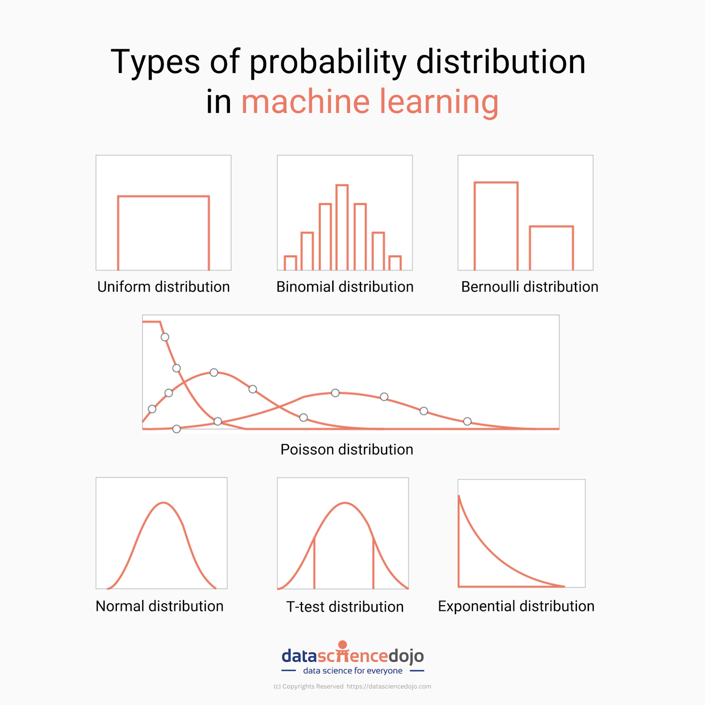

`image43.png`
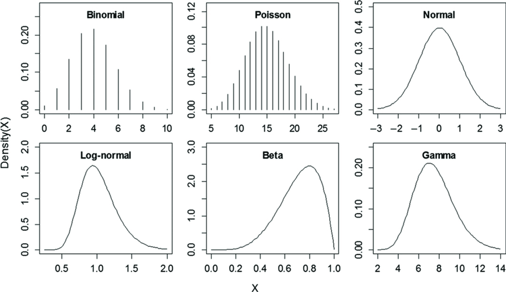

Key distributions: **Uniform, Binomial, Bernoulli, Poisson, Normal, T-distribution, Exponential, Log-normal, Beta, Gamma**.

---

### 1.5 Bernoulli Trial vs Binomial Distribution

- **Bernoulli trial**: A single experiment with only two outcomes (success/failure)
- **Binomial distribution**: Number of successes in a **sequence** of independent Bernoulli experiments

| Feature | Bernoulli Distribution | Binomial Distribution |
|:---|:---|:---|
| **Number of Trials (n)** | Exactly 1 trial ($n=1$) | Multiple trials ($n>1$) |
| **Possible Outcomes** | 0 (Failure) or 1 (Success) | Any integer from 0 to $n$ |
| **What it Measures** | The result of a single event | The total count of successes |
| **Parameters** | Probability of success $p$ | Number of trials $n$ and probability of success $p$ |
| **Real-World Example** | Flipping a coin once to see if it lands on Heads | Flipping a coin 10 times and counting how many times it lands on Heads |

---

### 1.6 Gaussian / Normal Distribution

"Gaussian distribution" and "normal distribution" refer to the **same concept**.

**PDF:**

$$f(x \mid \mu, \sigma^2) = \frac{1}{\sqrt{2\pi\sigma^2}} \exp\!\left(-\frac{(x-\mu)^2}{2\sigma^2}\right)$$

**Standard Normal** ($\mu = 0$, $\sigma = 1$):

$$f(x) = \frac{1}{\sqrt{2\pi}} \exp\!\left(-\frac{x^2}{2}\right)$$

**Key Characteristics:**
1. **Symmetry**: Symmetric around the mean
2. **Bell-shaped curve**
3. **Mean = Median = Mode** (all at center)
4. **68-95-99.7 Rule**: 68% within 1σ, 95% within 2σ, 99.7% within 3σ
5. **Central Limit Theorem**: Sum of many independent IID random variables tends toward normal distribution

`image88.png`
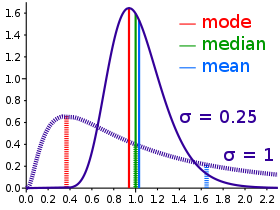

> $\mu$ = mean, $\sigma$ = standard deviation, $\sigma^2$ = variance

---

### 1.7 Covariance vs Correlation

**Covariance** — how two variables vary together:

$$\text{Cov}(X, Y) = \frac{\sum (X_i - \bar{X})(Y_i - \bar{Y})}{N}$$

**Correlation** — how the two variables are *related* (normalized covariance):

$$\text{Corr}(X, Y) = \frac{\text{Cov}(X, Y)}{\sigma_X \cdot \sigma_Y}$$

| | Covariance | Correlation |
|:---|:---|:---|
| **Range** | $(-\infty, +\infty)$ | $[-1, +1]$ |
| **Scale-dependent** | Yes | No |
| **Interpretation** | Direction of relationship | Direction + strength of relationship |

> **Why prefer correlation?** It is unaffected by changes in location and scale, and allows comparison across different pairs of variables.

`image79.jpg`
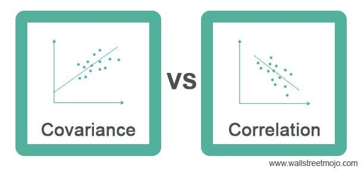

---

### 1.8 Entropy & Information Gain

**Entropy** — measure of uncertainty in a probability distribution:

$$H(S) = -\sum_i p_i \log_2 p_i$$

**Information Gain** — reduction in entropy from splitting on attribute A:

$$IG(A) = H(S) - \sum_{v} \frac{|S_v|}{|S|} H(S_v)$$

Where:
- $S$ — set of all instances in the dataset
- $N$ — number of distinct class values
- $p_i$ — event probability
- $H(S)$ — entropy of the whole dataset S
- $|S_v|$ — number of instances with value v of attribute A
- $|S|$ — total number of instances in dataset S
- $v$ — a single value of attribute A (the index the sum runs over)
- $S_v$ — subset of S for which attribute A has value v
- $H(S_v)$ — entropy of the subset $S_v$

*Example*: From the total of 14 instances we have: 9 instances 'yes', 5 instances 'no'. The Entropy is:

$$H(S) = -\sum_{i=1}^{N} p_i \log_2 p_i = -\frac{9}{14}\log_2\frac{9}{14} - \frac{5}{14}\log_2\frac{5}{14} = 0.940$$

---

### 1.9 Eigenvalues & Eigenvectors

An **eigenvector** is a special non-zero vector that, when transformed by a square matrix, does not change its direction — it is only stretched, squished, or flipped in reverse.

An **eigenvalue** is the scalar (a simple number) that tells you how much that eigenvector is stretched or shrunk:

$$A \mathbf{v} = \lambda \mathbf{v}$$

- $\lambda$ = **eigenvalue** (the scaling factor)
- $\mathbf{v}$ = **eigenvector**

**Finding Eigenvalues:**

$$(A - \lambda I)\mathbf{v} = 0 \quad \Rightarrow \quad \det(A - \lambda I) = 0$$

*Example with $A = \begin{bmatrix} 0 & 1 \\ -2 & -3 \end{bmatrix}$:*

$$\begin{vmatrix} -\lambda & 1 \\ -2 & -3-\lambda \end{vmatrix} = \lambda^2 + 3\lambda + 2 = 0 \quad \Rightarrow \quad \lambda_1 = -1,\ \lambda_2 = -2$$

**Finding Eigenvectors:**

Substitute each eigenvalue back into $(A - \lambda I)\mathbf{v} = 0$ and solve the resulting homogeneous system. Because $A - \lambda I$ is **singular**, its rows are linearly dependent (one equation is redundant), so a free variable remains — the eigenvector is determined only **up to a scalar** $k$ (any nonzero multiple is also an eigenvector, usually normalized to unit length).

*For $\lambda_1 = -1$:* substitute into $A - \lambda_1 I = A + I$:

$$(A - \lambda_1 I)\mathbf{v}_1 = \begin{bmatrix}1 & 1\\-2 & -2\end{bmatrix}\begin{bmatrix}v_{1,1}\\v_{1,2}\end{bmatrix} = 0$$

Both rows reduce to the same equation $v_{1,1} + v_{1,2} = 0 \Rightarrow v_{1,1} = -v_{1,2}$, giving $\mathbf{v}_1 = k_1\begin{bmatrix}+1\\-1\end{bmatrix}$

*For $\lambda_2 = -2$:* substitute into $A - \lambda_2 I = A + 2I$:

$$(A - \lambda_2 I)\mathbf{v}_2 = \begin{bmatrix}2 & 1\\-2 & -1\end{bmatrix}\begin{bmatrix}v_{2,1}\\v_{2,2}\end{bmatrix} = 0$$

Both rows reduce to $2v_{2,1} + v_{2,2} = 0 \Rightarrow v_{2,2} = -2v_{2,1}$, giving $\mathbf{v}_2 = k_2\begin{bmatrix}+1\\-2\end{bmatrix}$

---

## 2. Statistical Inference

### 2.1 Hypothesis Testing

A framework to make inferences about a population based on sample data.

**Steps:**

1. **Formulate Hypotheses**
   - $H_0$ (Null): No effect, no difference, no relationship — the status quo
   - $H_1$ (Alternative): Opposite of null; the effect/difference you suspect exists

2. **Choose Significance Level (α)**
   - Commonly 0.05 (5%) or 0.01 (1%)
   - Probability of rejecting $H_0$ when it is actually true (Type I error)

3. **Select Statistical Test** — depends on data type and hypothesis

4. **Calculate Test Statistic and P-Value**
   - P-value = probability of observing results as extreme as the data, assuming $H_0$ is true

5. **Decision Rule**
   - If $p \leq \alpha$: **Reject** $H_0$
   - If $p > \alpha$: **Fail to reject** $H_0$ (does NOT mean $H_0$ is true)

6. **Draw Conclusions**

**Key Concepts:**

| Error Type | Definition |
|:---|:---|
| **Type I Error** | Rejecting $H_0$ when it is actually true (false positive) |
| **Type II Error** | Failing to reject $H_0$ when it is actually false (false negative) |
| **Power** | Probability of correctly rejecting $H_0$ when it is false = $1 - P(\text{Type II})$ |

**Significance Level (α) vs P-Value:**

| Feature | Significance Level (α) | P-Value |
|:---|:---|:---|
| **What it is** | A pre-set cutoff for risk | The probability of your observed data happening by chance |
| **When it is set** | Before collecting data | After analyzing data |
| **Control** | Chosen entirely by the researcher | Calculated from the sample data |
| **Common values** | Typically 0.05, 0.01, or 0.10 | Variable (any number between 0 and 1) |

- Think of the significance level as a high-jump bar set at a specific height (e.g., 5 feet) before the competition starts.
- The p-value represents the actual performance of the athlete.
- If the athlete clears the bar (if the p-value is lower than the threshold of error you are willing to accept), they pass the test.

---

### 2.2 Statistical Tests: Chi-Square vs T-Test

| | Chi-Square Test | T-Test |
|:---|:---|:---|
| **Purpose** | Test for significant association between **categorical variables** | Test for significant difference between the **means of two groups** |
| **Types** | *Test of independence* (are two categorical variables related?)<br>*Goodness of fit* (do observed data fit a theoretical distribution?) | *Independent t-test* (two independent groups)<br>*Paired t-test* (two related groups, e.g. before/after) |
| **Data Type** | Categorical | Numerical (continuous) |
| **Assumptions** | Variables are categorical; observations are independent; expected frequency in each cell ≥ 5 | Data approximately normally distributed; equal variances; independent observations |
| **Statistic** | $\chi^2 = \sum \frac{(O - E)^2}{E}$, where $O$ = observed, $E$ = expected frequency | See §2.3 for the t-statistic formula |

---

### 2.3 P-Value Calculation

#### Z-Test (known population std dev)

$$Z = \frac{\bar{x} - \mu}{\sigma / \sqrt{n}}$$

where $\bar{x}$ = sample mean, $\mu$ = hypothesized population mean, $\sigma$ = population standard deviation, $n$ = sample size, and $Z_{stat}$ = the computed $Z$ value.

- Two-tailed: $p = 2 \times P(Z > |Z_{stat}|)$
- One-tailed: $p = P(Z > Z_{stat})$

#### Independent T-Test

$$t = \frac{\bar{x}_1 - \bar{x}_2}{\sqrt{\frac{s_1^2}{n_1} + \frac{s_2^2}{n_2}}}$$

where $\bar{x}_1, \bar{x}_2$ = the two sample means, $s_1^2, s_2^2$ = the sample variances, and $n_1, n_2$ = the sample sizes.

Use t-distribution with appropriate degrees of freedom.

#### Chi-Square Test

$$\chi^2 = \sum \frac{(O - E)^2}{E}$$

where $O$ = observed frequency, $E$ = expected frequency under the null hypothesis. Degrees of freedom depend on the test:
- **Goodness-of-fit:** $df = (\text{number of categories}) - 1$
- **Test of independence** ($r \times c$ table): $df = (r-1)(c-1)$

#### ANOVA (F-Test)

$$F = \frac{\text{Between-group variability}}{\text{Within-group variability}}$$

where the numerator is the mean square *between* groups (spread of the group means around the grand mean) and the denominator is the mean square *within* groups (average spread inside each group); a larger $F$ ⇒ stronger evidence that the group means differ.

**General Steps:** Calculate statistic → Identify distribution → Look up p-value → Compare to α → Report conclusion.

---

### 2.4 Probability vs Likelihood

`image49.jpg`
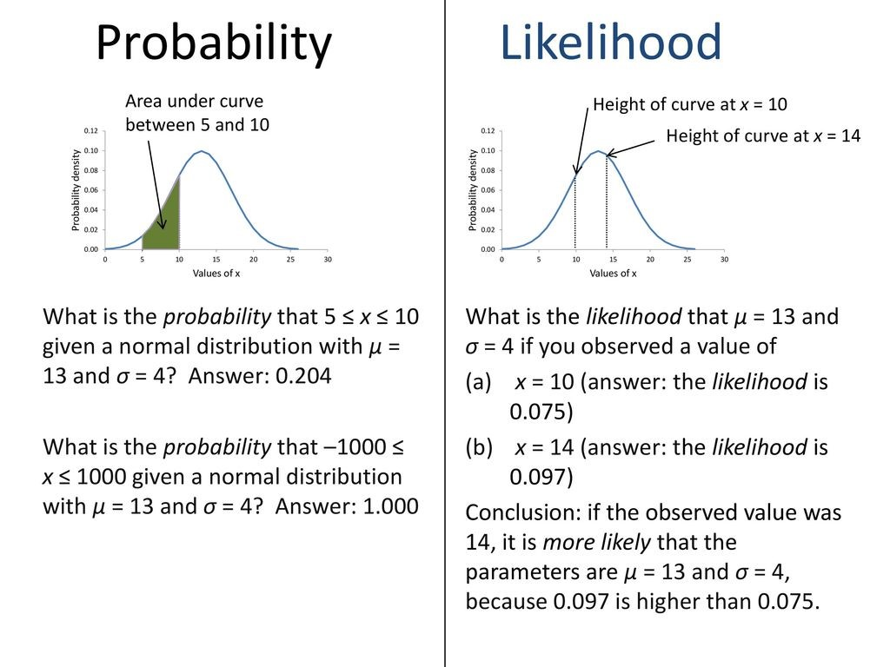

| | Probability | Likelihood |
|:---|:---|:---|
| **What varies** | Data values (x) | Parameters (μ, σ) |
| **What is fixed** | Distribution parameters | Observed data |
| **Example** | $P(\text{height} > 170 \mid \mu = 170, \sigma = 3.5)$ | $\mathcal{L}(\mu, \sigma \mid \text{height} > 170)$ |

- **Probability** measures the likelihood of an event occurring based on a given distribution
  - Feature values vary; distribution parameters are fixed
- **Likelihood** measures the plausibility of different parameter values within a statistical model, based on observed data
  - Parameters vary; observed data is fixed — we find which parameters best explain the observed data

---

### 2.5 Maximum Likelihood Estimation (MLE)

A probabilistic framework for **density estimation** — finding the mean and standard deviation of a PDF.

`image44.png`
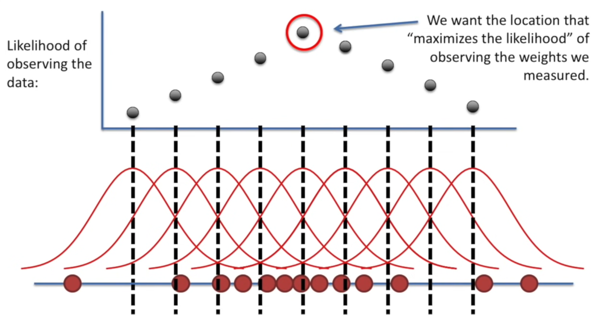

- **Goal**: Maximize the likelihood function to find parameters that best explain the observed data
- Provides a framework for predictive modeling where **finding model parameters = optimization problem**
- Used in: Gaussian Mixture Models (via EM), linear regression, logistic regression

$$\hat{\theta}_{MLE} = \arg\max_\theta \sum_{i=1}^{n} \log P(x_i \mid \theta)$$

`image86.png`
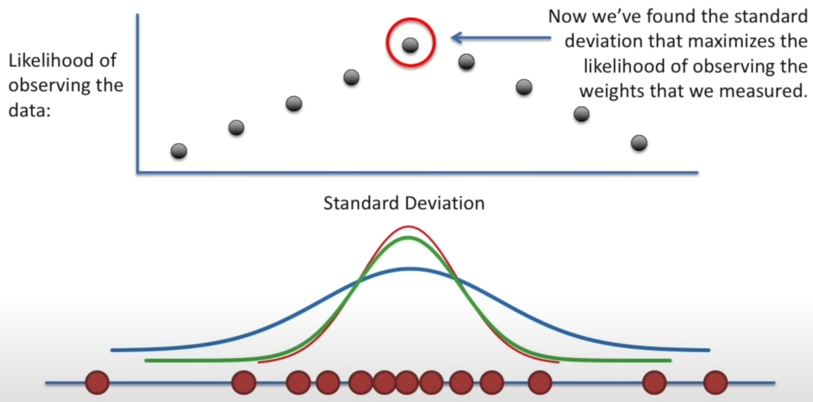

---

### 2.6 MAP vs MLE

| | MLE | MAP |
|:---|:---|:---|
| **Type** | Frequentist | Bayesian |
| **Prior** | None (uniform assumed) | Incorporates prior belief $P(\theta)$ |
| **Formula** | $\arg\max \sum \log P(x_i \mid \theta)$ | $\arg\max \sum \log P(x_i \mid \theta) + \log P(\theta)$ |
| **Relation** | Special case of MAP | Reduces to MLE with uniform prior |

**Relation Between MLE and MAP**

---

What we could conclude then is that MLE is a special case of MAP, where the prior is uniform.

$$\theta_{MAP} = \arg\max_\theta \left[\sum_i \log P(x_i \mid \theta) + \log P(\theta)\right]$$

$$= \arg\max_\theta \left[\sum_i \log P(x_i \mid \theta) + \text{const}\right]$$

$$= \arg\max_\theta \sum_i \log P(x_i \mid \theta)$$

$$= \theta_{MLE}$$

---

## 3. Core ML Concepts

### 3.1 Empirical Risk Minimization (ERM)

ERM is the foundational principle in machine learning: find parameters that minimize the **average error (loss) on the training dataset**. It is a practical substitute for minimizing the true, unattainable risk across all possible real-world data.

| Concept | Definition |
|:---|:---|
| **Loss Function** L | Quantifies the error between true output $y_i$ and predicted output $h(x_i)$ |
| **True Risk** R(h) | $R(h) = \mathbb{E}_{(x,y) \sim p}[L(y, h(x))]$ — uses the unknown true distribution $P$ |
| **Empirical Risk** $\hat{R}(h)$ | $\hat{R}(h) = \frac{1}{n} \sum_{i=1}^{n} L(y_i, h(x_i))$ — computed on training data |
| **ERM Objective** | $h^* = \arg\min_{h \in \mathcal{H}} \hat{R}(h)$ — find the model with the lowest average training error |

---

### 3.2 Bias-Variance Tradeoff

$$\text{MSE} = \mathbb{E}[(\hat{y} - y)^2] = \underbrace{\mathbb{E}[(\hat{y} - \mathbb{E}[\hat{y}])^2]}_{\text{Variance}} + \underbrace{(\mathbb{E}[\hat{y}] - y)^2}_{\text{Bias}^2}$$

`image56.png`
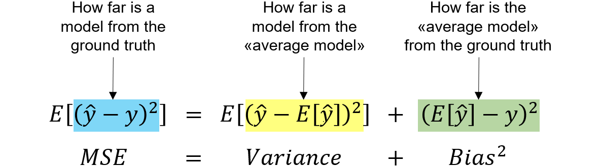

`image22.png`
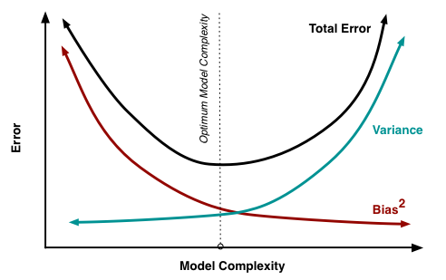

`image63.png`
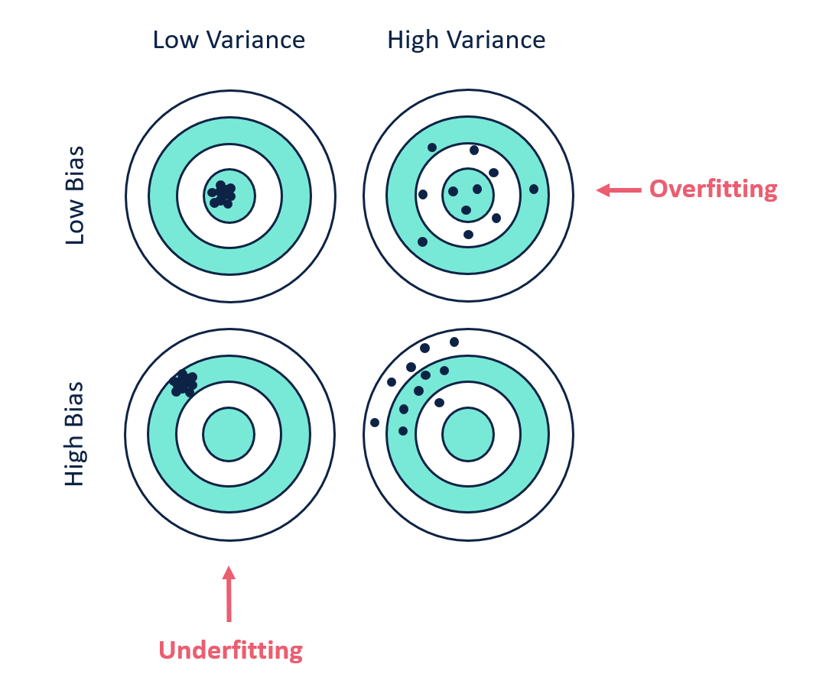

| Scenario | Bias | Variance | Effect |
|:---|:---|:---|:---|
| **Underfitting** | High | Low | Poor on train and test |
| **Overfitting** | Low | High | Good on train, poor on test |
| **Ideal** | Low | Low | Good generalization |

**Reduce Bias (Underfitting):**
1. Increase model complexity
2. Feature engineering
3. Reduce regularization
4. Increase training time

**Reduce Variance (Overfitting):**
1. Regularization (L1/L2)
2. Cross-validation
3. Feature selection
4. Ensemble methods
5. Early stopping
6. Data augmentation

---

### 3.3 Evaluation Metrics

`image24.png`
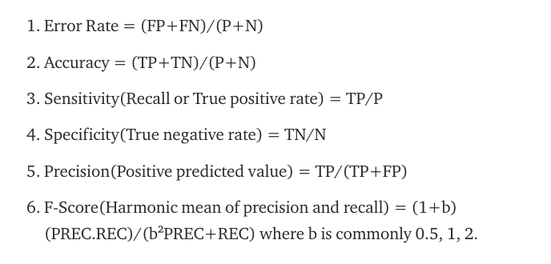

$$\text{Accuracy} = \frac{TP + TN}{TP + TN + FP + FN}$$

$$\text{Precision} = \frac{TP}{TP + FP} \quad \text{(of all positive predictions, how many were correct?)}$$

$$\text{Recall} = \frac{TP}{TP + FN} \quad \text{(of all actual positives, how many were found?)}$$

$$\text{F1} = \frac{2}{\frac{1}{\text{Precision}} + \frac{1}{\text{Recall}}} = \frac{2 \times \text{Precision} \times \text{Recall}}{\text{Precision} + \text{Recall}}$$

**F-Beta Score** — generalizes F1 with weight $\beta$ on recall:

$$F_\beta = \frac{(1 + \beta^2)}{\frac{\beta^2}{\text{Recall}} + \frac{1}{\text{Precision}}}$$

- $\beta = 1$: Equal weight to precision and recall (standard F1)
- $\beta > 1$: More weight on recall
- $\beta < 1$: More weight on precision

**F1 is preferred when:**
- There is **class imbalance**
- Both precision and recall are important

---

### 3.4 Confusion Matrix

`image62.png`
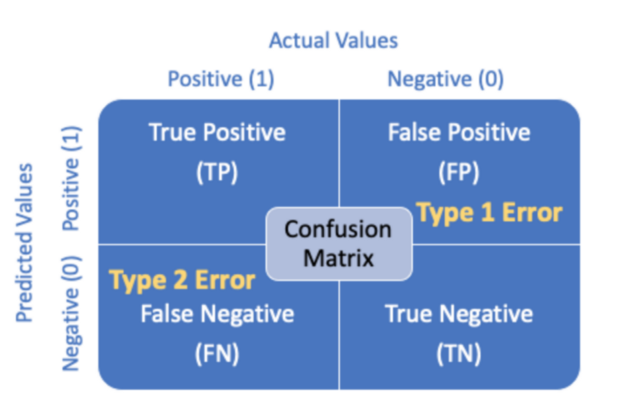

| | Predicted Positive | Predicted Negative |
|:---|:---|:---|
| **Actual Positive** | TP | FN (Type II Error) |
| **Actual Negative** | FP (Type I Error) | TN |

- **Type I Error** (False Positive): Model predicts positive, but it's negative (e.g., predicts cancer when there is none)
- **Type II Error** (False Negative): Model predicts negative, but it's positive (e.g., misses an actual cancer case)

---

### 3.5 Micro vs Macro Averaging

| | When to Use |
|:---|:---|
| **Equal-sized labels** | Use any method |
| **Imbalanced labels — bias toward most populated** | Use **Micro** averaging |
| **Imbalanced labels — equal weight to all classes** | Use **Macro** averaging |

**Micro Averaged metrics given two different set of data:**

$$Micro - Precision = \frac{TruePositives1 + TruePositives2}{TruePositives1 + FalsePositives1 + TruePositives2 + FalsePositives2}$$

$$Micro - Recall = \frac{TruePositives1 + TruePositives2}{TruePositives1 + FalseNegatives1 + TruePositives2 + FalseNegatives2}$$

$$Micro - F - Score = 2 \cdot \frac{Micro{-}Precision \cdot Micro{-}Recall}{Micro{-}Precision + Micro{-}Recall}$$

**Macro Averaged metrics with two datasets:**

$$Macro - Precision = \frac{Precision1 + Precision2}{2}$$

$$Macro - Recall = \frac{Recall1 + Recall2}{2}$$

$$Macro - F - Score = 2 \cdot \frac{Macro{-}Precision \cdot Macro{-}Recall}{Macro{-}Precision + Macro{-}Recall}$$

- **True Positive Rate (Sensitivity/Recall)** = $TP / P$
- **False Positive Rate** = $1 - \text{Specificity}$ = $FP / N$

---

### 3.6 ROC Curve & AUC

**ROC** plots **True Positive Rate (TPR)** vs **False Positive Rate (FPR)** across all classification thresholds.

`image64.png`
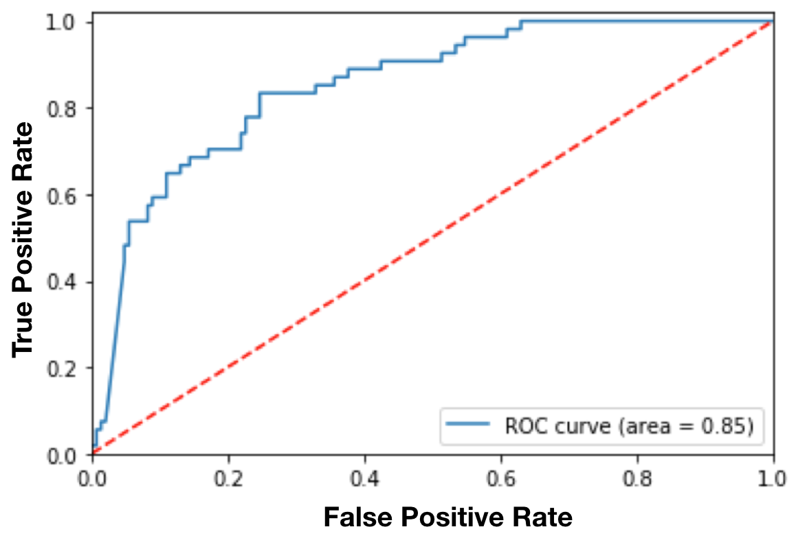

- AUC = 1.0: Perfect classifier
- AUC = 0.5: Random classifier
- AUC = 0.85: Good classifier (shown above)

---

### 3.7 R² and Adjusted R²

**R² (Coefficient of Determination):**

$$R^2 = 1 - \frac{SS_{\text{residual}}}{SS_{\text{total}}}$$

where $SS_{\text{residual}} = \sum_i (y_i - \hat{y}_i)^2$ (sum of squared residuals) and $SS_{\text{total}} = \sum_i (y_i - \bar{y})^2$ (total sum of squares about the mean $\bar{y}$); $y_i$ = actual value, $\hat{y}_i$ = predicted value.

- Range: $[0, 1]$ for in-sample OLS with an intercept; can be **negative** out-of-sample or without an intercept (model does worse than predicting the mean)
- Higher = more variance explained by the model
- **Limitation**: Increases with more predictors even if they don't help → doesn't penalize overfitting

**Adjusted R²:**

$$R^2_{\text{adj}} = 1 - \frac{(1 - R^2)(n - 1)}{n - k - 1}$$

where $n$ = observations, $k$ = number of predictors.

- Penalizes for adding unnecessary variables
- Only increases if the new variable improves the model beyond chance
- Can be negative
- **Preferred** when comparing models with different numbers of predictors

| | R² | Adjusted R² |
|:---|:---|:---|
| **Penalization** | None | Penalizes unnecessary variables |
| **Range** | [0, 1] | $(-\infty, 1]$ |
| **Use** | Model fit assessment | Model comparison across different #predictors |

---

### 3.8 Cross-Validation

**K-Fold Cross-Validation:**
- Split data into k folds; train k-1, test on remaining fold
- Repeat k times, average results
- Used to **estimate generalization / tune hyperparameters** — the k fold-models are only for evaluation; afterward you retrain a single final model on all data for inference (combining all k at inference is a separate technique, CV ensembling)

*Example (10-Fold):* With 100 rows, split into 10 groups of 10. Train the model 10 times — each time on 90 rows, testing on the remaining 10.

**Leave-One-Out (LOO):**
- k = n (number of data points)
- One test point per fold
- Suitable for small datasets

*Example (LOOCV):* With 100 rows, split into 100 groups of 1. Train the model 100 times — each time on 99 rows, testing on exactly 1 row.

---

## 4. Feature Engineering & Data

### 4.1 Feature Scaling

`image25.png`
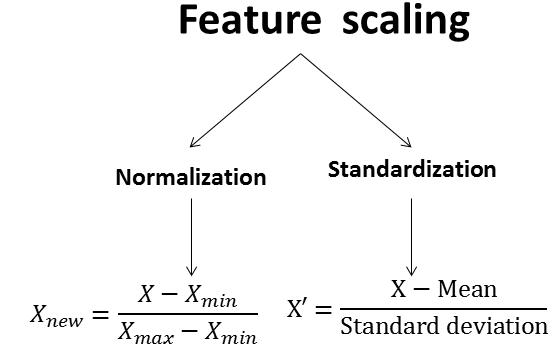

**Normalization (Min-Max Scaling):**

$$X_{\text{new}} = \frac{X - X_{\min}}{X_{\max} - X_{\min}} \in [0, 1]$$

**Standardization (Z-score):**

$$X' = \frac{X - \mu}{\sigma} \quad \text{(mean=0, std=1)}$$

**When to Use:**

| Method | Use When |
|:---|:---|
| **Normalization** | Data does NOT follow Gaussian distribution; algorithms like KNN, Neural Networks |
| **Standardization** | Data follows (roughly) Gaussian distribution; SVM, Linear/Logistic Regression, PCA. *Note: z-score is NOT robust to outliers (mean & std are distorted by extreme values) — use RobustScaler (median + IQR) when outliers are present.* |

**Why Feature Scaling Matters:**
- Required when features have very different ranges
- Helps gradient descent converge faster
- Distance-based algorithms are dominated by large-magnitude features without scaling
- Prevents weight explosions during training

---

### 4.2 Curse of Dimensionality

As the number of features/dimensions increases with a fixed training set size:
- Performance initially improves, then **degrades** beyond a certain dimensionality
- With more features than observations → risk of massively overfitting
- Distance-based methods lose meaning (all points become equidistant in high dimensions)

**Rules of thumb:**
- At least **5 training examples per dimension**
- Use **PCA** to reduce dimensionality before modeling

---

## 5. Classical ML Models

### 5.1 Nonparametric Models

Models that **do not assume a fixed form** for the underlying data distribution — the number of parameters grows with data.

| Model | Description |
|:---|:---|
| **k-Nearest Neighbors (k-NN)** | Predicts based on k closest training examples; no functional form assumed |
| **Decision Trees** | Recursively splits data; complexity grows with data size |
| **Kernel Density Estimation (KDE)** | Estimates PDF by averaging kernel functions centered at each data point |
| **Gaussian Processes (GP)** | Defines distribution over functions; complexity grows with data |
| **Random Forests** | Ensemble of decision trees; depth and count can vary |
| **SVM with Non-linear Kernels** | RBF kernel behaves nonparametrically |

---

### 5.2 Naive Bayes

**Why "Naive"?** It assumes **conditional independence of features given the class label** — i.e., $P(x_i \mid c, x_j) = P(x_i \mid c)$ for all $i \neq j$ — a condition virtually never fully met in real-world data.

**Bayes' Theorem:**

`image75.png`
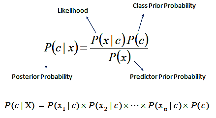

$$P(c \mid x) = \frac{P(x \mid c) \cdot P(c)}{P(x)}$$

where:
- $P(c \mid x)$ = **Posterior Probability** (probability of class given data)
- $P(x \mid c)$ = **Likelihood** (probability of data given class)
- $P(c)$ = **Class Prior Probability**
- $P(x)$ = **Predictor Prior Probability** (evidence — normalising constant)

With the naive independence assumption (dropping the constant evidence $P(X)$, so it's a proportionality):

$$P(c \mid X) \propto P(c) \cdot P(x_1 \mid c) \cdot P(x_2 \mid c) \cdots P(x_n \mid c)$$

**Types:**

| Naive Bayes Type | Likelihood Model | Use Case |
|:---|:---|:---|
| **Multinomial NB** | Count of word/token occurrences | Text classification (word counts) |
| **Gaussian NB** | Gaussian distribution: $P(x\|c) = \mathcal{N}(\mu_c, \sigma_c^2)$ | Continuous features |
| **Bernoulli NB** | Bernoulli (presence/absence of feature) | Binary feature vectors |

**Gaussian Naive Bayes:**

$$P(x = v \mid c) = \frac{1}{\sqrt{2\pi\sigma_c^2}} \exp\!\left(-\frac{(v - \mu_c)^2}{2\sigma_c^2}\right)$$

---

### 5.3 K-Nearest Neighbors (KNN)

**Non-parametric, supervised** algorithm — classifies a query point by majority vote (or averages, for regression) among its $k$ nearest training points. Based on the idea that similar points lie near one another.

**Algorithm:**
1. Compute the distance from the query point to every training point
2. Sort ascending; take the top $k$
3. **Classification** → majority vote of the $k$ labels; **Regression** → mean of the $k$ labels

**Distance metrics:**

| Metric | Formula | Best for |
|:---|:---|:---|
| **Euclidean (L2)** | $d(x,y) = \sqrt{\sum_i (y_i - x_i)^2}$ | Continuous, normalized, low-dimensional data |
| **Manhattan (L1)** | $d(x,y) = \sum_i \|x_i - y_i\|$ | Different feature scales, outliers, high-dimensional/sparse data |

**Why not Cosine similarity by default?**
- Fails the **triangle inequality** → breaks tree-based indexing (KD-Tree/Ball Tree), forcing slower brute-force search
- Ignores **magnitude** — only direction matters, so points with the same ratio but very different scale look identical (bad when scale is meaningful; good for text/embeddings)
- If vectors are **unit-normalized**, Euclidean ranking = Cosine ranking: $\text{Euclidean} = \sqrt{2(1-\cos)}$

**Pros:** simple; no training phase; only 2 hyperparameters ($k$, distance metric).
**Cons:** doesn't scale (memory/lookup cost); low $k$ → overfits, high $k$ → underfits.
**Use case:** small, relatively clean datasets; labeled data is scarce/expensive.

---

### 5.4 K-Means Clustering

**Unsupervised** — partitions data into $K$ clusters by iteratively minimizing distance to cluster centroids (Expectation-Maximization).

**Algorithm:**
1. **Init** — choose $K$; place $K$ random initial centroids
2. **Assign (E-step)** — assign each point to its nearest centroid (Euclidean distance)
3. **Update (M-step)** — move each centroid to the mean of its assigned points
4. Repeat 2–3 until centroids stop moving (or max iterations reached)

**Why Euclidean-only?** The arithmetic mean is exactly the point that minimizes the sum of *squared Euclidean* distances. Using Manhattan distance instead requires the median (→ **K-Medians**); a custom distance requires **K-Medoids**.

**Choosing $K$:** Elbow Method or Silhouette Score.

---

### 5.5 KNN vs K-Means

| | KNN | K-Means |
|:---|:---|:---|
| **Type** | Supervised | Unsupervised |
| **Task** | Classification (or regression) | Clustering |
| **k** | Number of neighbors | Number of clusters |
| **Distance metric** | Euclidean, Manhattan, or Cosine | Euclidean (by design) |

---

### 5.6 Decision Trees

**Choosing the split at each node:** Grown greedily, top-down — at each node, test every feature (and threshold, for numeric features) and pick the one with the **highest Information Gain** (largest impurity drop), then recurse until a stopping rule (pure node, max depth, or min samples).

**Information Gain** — the reduction in entropy after splitting on attribute $A$ (see §1.8):

$$IG(A) = H(S) - \sum_{v} \frac{|S_v|}{|S|} H(S_v), \qquad H(S) = -\sum_i p_i \log_2 p_i$$

where $S$ is the data at the node, $S_v$ the subset where attribute $A$ takes value $v$, and $H(\cdot)$ the entropy. The feature with the largest $IG$ is chosen for the split. (**Gini impurity** $= 1 - \sum_i p_i^2$ is the common alternative criterion used by CART.)

`image40.png`
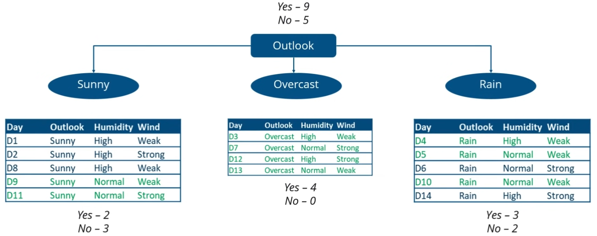

`image55.png`
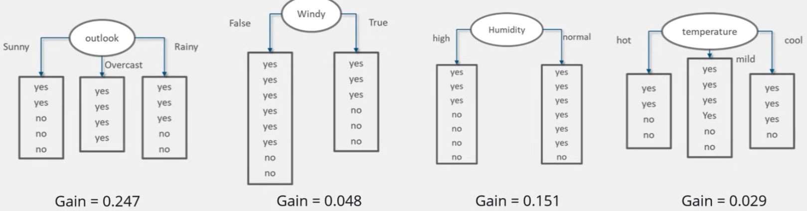

**Overfitting in Decision Trees:**
- Trees can form a branch for each data point → no generalization
- Fix: **Pruning** — remove parts of tree that don't improve classification power

**Pruning:** Reduces tree size by removing subtrees that add no predictive value.

**Decision Tree vs Random Forest:**

| | Decision Tree | Random Forest |
|:---|:---|:---|
| **Interpretability** | Simple, explainable | Black box |
| **Accuracy trend** | Improves with more splits → prone to overfitting | Improves with more trees until it plateaus |
| **Feature selection** | Considers all features at each split | Considers random feature subset at each split |
| **Use when** | Need simplicity/explainability; small dataset | Need accuracy and robustness; large dataset |

> Random Forest is a black box — specify `n_estimators` (number of trees) and `max_features`; accuracy improves with more trees until it plateaus and stops changing.

---

### 5.7 Ordinal Regression

Train binary classifiers for each threshold, then combine:

```
Binary target = 1 if rating > 1  →  model predicts P(Target > 1)
Binary target = 1 if rating > 2  →  model predicts P(Target > 2)
Binary target = 1 if rating > 3  →  model predicts P(Target > 3)
Binary target = 1 if rating > 4  →  model predicts P(Target > 4)
```

**Convert to class probabilities:**

$$\begin{aligned}
P(y=1) &= 1 - P(T>1) \\
P(y=2) &= P(T>1) - P(T>2) \\
P(y=3) &= P(T>2) - P(T>3) \\
P(y=4) &= P(T>3) - P(T>4) \\
P(y=5) &= P(T>4)
\end{aligned}$$

`image50.png`
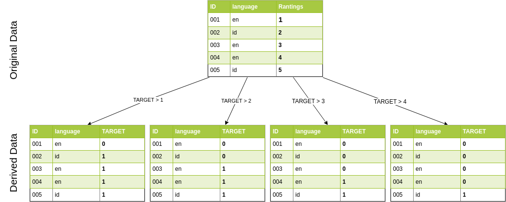

`image65.png`
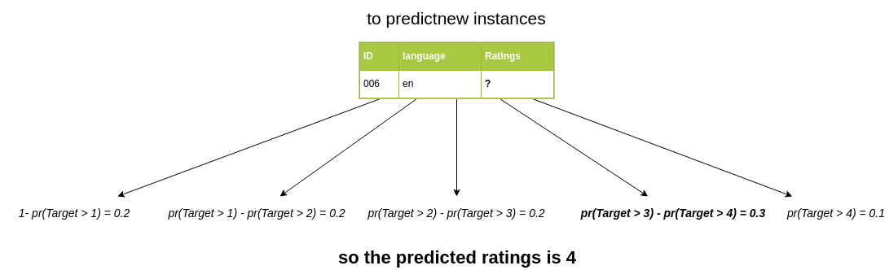

---

### 5.8 Support Vector Machines (SVM)

**Core Concepts:**

- **Hyperplane**: Decision boundary separating classes. In 2D it's a line; in higher dimensions, a flat affine subspace.
- **Support Vectors**: Data points closest to the hyperplane — they determine its position and orientation.
- **Margin**: Distance between hyperplane and nearest support vectors. SVM **maximizes** this margin.
- **Kernel Trick**: Transforms input data to a higher-dimensional space to find a separating hyperplane without explicitly computing coordinates.

**SVM Objective (with C regularization):**

$$\min_\theta\ C \sum_{i=1}^{m} \left[ y^{(i)} \cdot \text{cost}_1(\theta^T x^{(i)}) + (1 - y^{(i)}) \cdot \text{cost}_0(\theta^T x^{(i)}) \right] + \frac{1}{2} \sum_{j=1}^{n} \theta_j^2$$

**Hypothesis:**

$$h_\theta(x) = \begin{cases} 1 & \text{if } \theta^T x \geq 0 \\ 0 & \text{otherwise} \end{cases}$$

**Kernels:**

| Kernel | Formula | Use Case |
|:---|:---|:---|
| **Linear** | $k(x,y) = x^T y$ | Linearly separable data |
| **Polynomial** | $k(x,y) = (x^T y)^p$ | Non-linear data |
| **RBF / Gaussian** | $k(x,y) = \exp\!\left(-\frac{\|x-y\|^2}{2\sigma^2}\right)$ | Non-linear, high-dimensional data |
| **Sigmoid** | $k(x,y) = \tanh(\alpha x^T y + c)$ | Proxy for neural networks |

`image81.png`
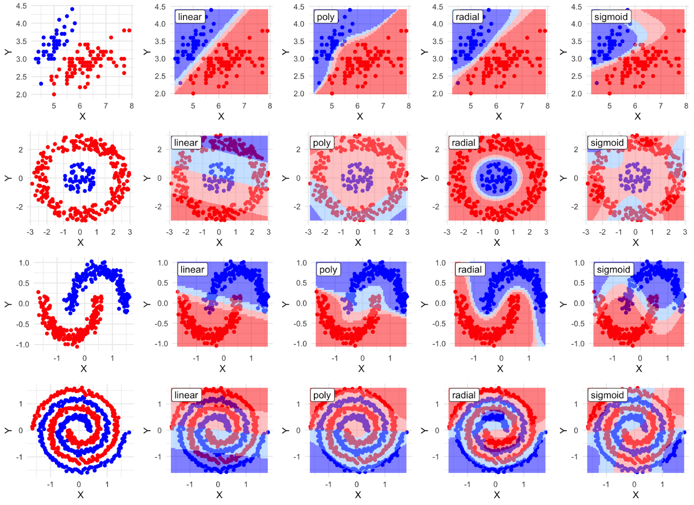

**Why Gaussian RBF maps to infinite-dimensional space:**

The Gaussian RBF kernel corresponds to a fixed, **infinite-dimensional** feature space, regardless of the amount of training data. With $m$ training points, the SVM solution lies in an (at most) $m$-dimensional **subspace** of that space — the span of the mapped training points (equivalently, the rank of the $m \times m$ Gram matrix). The kernel trick lets the SVM work implicitly in this infinite-dimensional space without ever computing the coordinates.

**C Parameter (Regularization):**
- Small C → wider margin, more misclassifications allowed (softer boundary)
- Large C → narrower margin, fewer misclassifications (harder boundary)

**Support Vector Regression (SVR):** Regression counterpart — fits data within a margin of tolerance.

---

### 5.9 Algorithm Quick-Reference

| Algorithm | Definition | Pros | Cons |
|:---|:---|:---|:---|
| **Linear Regression** | Predicts a continuous target as a linear combination of features | Simple, interpretable, fast | Assumes linearity; sensitive to outliers |
| **Decision Trees** | Hierarchical if/else rules leading to a prediction | Interpretable; handles numeric + categorical; captures non-linearity | Prone to overfitting; unstable to small data changes |
| **Random Forest** | Ensemble of decision trees (bagging) | Robust; handles high dimensions; gives feature importance | Costlier to compute; less interpretable than a single tree |
| **SVM** | Finds the optimal separating hyperplane (margin maximization) | Effective in high dimensions; kernel trick for non-linear data; robust to outliers | Sensitive to kernel/parameter choice; slow on large datasets |
| **Naive Bayes** | Probabilistic classifier assuming feature independence (Bayes' theorem) | Simple, fast, works well in high dimensions and with categorical features | Independence assumption rarely holds; misses feature interactions |
| **Neural Networks** | Layers of interconnected neurons learning complex patterns | Powerful and flexible; scales with data; handles many data types | Needs lots of data; compute-intensive; overfits without regularization |
| **KNN** | Classifies by majority vote among the $k$ nearest training points | Simple; no training phase; good for small/non-linear data | Slow at prediction time; sensitive to irrelevant features; no explicit model |
| **Gradient Boosting** | Ensemble that sequentially fits weak learners to residual errors | Highly accurate; handles missing values; gives feature importance | Prone to overfitting if untuned; computationally expensive |

---

## 6. Ensemble Methods

Ensemble learning combines multiple **weak learners** to produce a stronger model.

### 6.1 Random Forest vs Bagging

**Both use Bootstrap Sampling:**
- Each tree trains on a random sample of data **with replacement**
- Some data points repeat; some are omitted

**Key Difference — Feature Selection:**

| | Random Forest | Bagging |
|:---|:---|:---|
| **At each split** | Randomly selects a **subset of features** | Considers **all features** |
| **Correlation** | Reduces inter-model correlation more effectively | Higher correlation between models |

> Random Forest's feature subsampling is the core addition over plain Bagging.

---

### 6.2 Bagging vs Boosting

`image69.png`
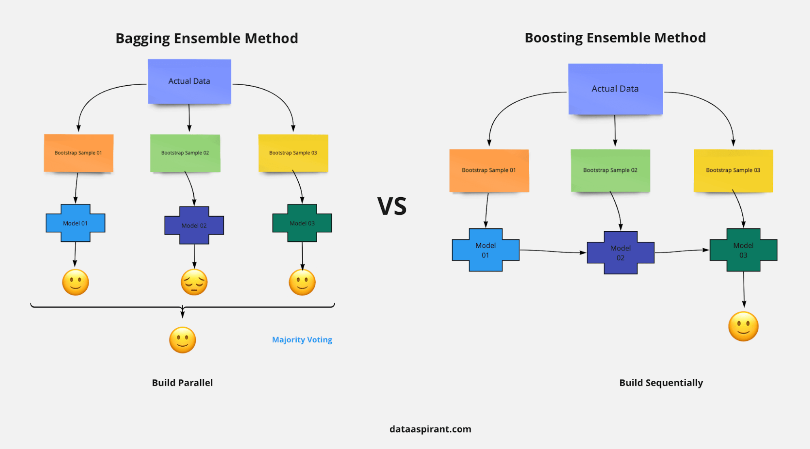

<table>
<thead>
<tr><th></th><th>Bagging</th><th>Boosting</th></tr>
</thead>
<tbody>
<tr>
<td><strong>Similarities</strong></td>
<td colspan="2">
&bull; Uses voting<br>
&bull; Combines models of the same type
</td>
</tr>
<tr>
<td rowspan="2"><strong>Differences</strong></td>
<td>Individual models are built separately</td>
<td>Each new model is influenced by the performance of those built previously</td>
</tr>
<tr>
<td>Equal weight is given to all models</td>
<td>Weights a model's contribution by its performance</td>
</tr>
</tbody>
</table>

**Bagging Details:**
1. Generate multiple bootstrap samples from training data
2. Train a separate model on each sample (independently, in parallel)
3. Combine predictions (average for regression, vote for classification)

**Boosting Details:**
1. Initialize weights equally
2. Train first weak learner
3. Increase weights of misclassified instances
4. Train next model on re-weighted data
5. Repeat → combine all models with weighted voting

> **Summary**: Bagging mainly focuses on getting an ensemble model with less variance than its components; boosting mainly tries to produce strong models less biased than their components.

---

### 6.3 Boosting Variants

Three main types: **Gradient Boosting**, **AdaBoost**, **XGBoost** ("eXtreme Gradient Boosting").

| | AdaBoost | Gradient Boosting |
|:---|:---|:---|
| **Weight update** | Increases weights of misclassified samples each iteration | Updates by computing negative gradient of loss function |
| **Base learners** | Decision stumps (single split) | Wide range: trees, linear models, etc. |
| **Noise sensitivity** | More susceptible — assigns high weights to misclassified points | More robust — gradient updates are less sensitive to outliers |

---

### 6.4 XGBoost vs Random Forest

| | XGBoost | Random Forest |
|:---|:---|:---|
| **Algorithm** | Sequential gradient boosting | Parallel bagging of decision trees |
| **Accuracy** | Generally higher on structured/tabular data | Solid baseline, competitive |
| **Speed** | Optimized with parallelization + hardware acceleration | Slower prediction with many trees |
| **Tuning** | Requires careful tuning | Minimal tuning needed |
| **Regularization** | Built-in L1 (Lasso) and L2 (Ridge) | None built-in |
| **Overfitting** | Can overfit on small datasets if not regularized | More robust via averaging |
| **Interpretability** | Feature importance available | Feature importance available, but less interpretable overall |
| **Use cases** | Competitive ML, large structured datasets | Quick robust baseline, many problem types |

**Summary:**
- **Random Forest**: Quick, robust, out-of-the-box. Good when you need a reliable model with minimal tuning.
- **XGBoost**: Superior performance on complex datasets, but requires more careful tuning.

---

## 7. Regularization & Loss Functions

### 7.1 L1 vs L2 Regularization

| L1 Regularization | L2 Regularization |
|:---|:---|
| Penalizes the sum of absolute value of weights. | Penalizes the sum of square weights. |
| It has a sparse solution. | It has a non-sparse solution. |
| It gives multiple solutions. | It has only one solution. |
| Constructed in feature selection. | No feature selection. |
| Robust to outliers. | Not robust to outliers. |
| It generates simple and interpretable models. | It gives more accurate predictions when the output variable is the function of whole input variables. |
| Unable to learn complex data patterns. | Able to learn complex data patterns. |
| Computationally inefficient over non-sparse conditions. | Computationally efficient because of having analytical solutions. |

**L1 is not differentiable at 0:**

$$\frac{d|x|}{dx} = \begin{cases} -1 & x < 0 \\ +1 & x > 0 \\ \text{undefined} & x = 0 \end{cases}$$

Subgradient methods are used to handle this.

`image34.png`
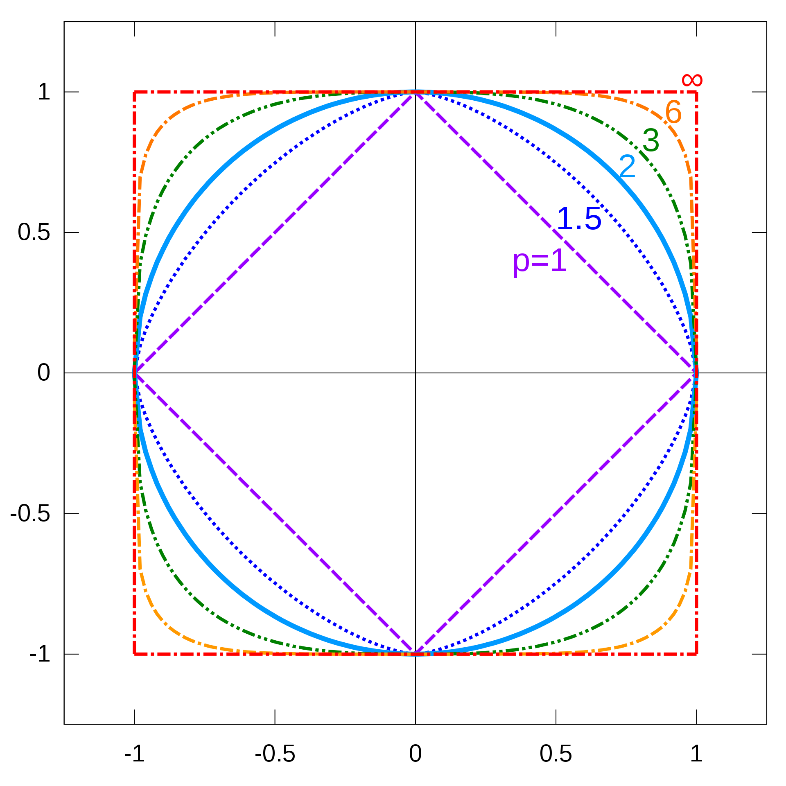

`image52.jpg`
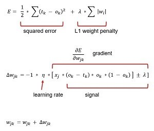

---

### 7.2 Loss Functions

**Regression Losses:**

| Loss Function | Description | Formula | When to Use |
|:---|:---|:---|:---|
| **Mean Bias Error (MBE)** | Captures average bias; rarely used for training | $\frac{1}{N}\sum_{i=1}^N (y_i - f(x_i))$ | Diagnosing directional bias (over- vs under-prediction), not training |
| **Mean Absolute Error (MAE)** | Measures absolute bias; also called L1 Loss | $\frac{1}{N}\sum_{i=1}^N \|y_i - f(x_i)\|$ | Data with outliers you don't want to dominate; errors in original units |
| **Mean Squared Error (MSE)** | Average squared distance; also called L2 Loss | $\frac{1}{N}\sum_{i=1}^N (y_i - f(x_i))^2$ | Clean data where large errors must be punished hard; smooth gradient |
| **Root MSE (RMSE)** | Square root of MSE; same units as dependent variable | $\sqrt{\frac{1}{N}\sum_{i=1}^N (y_i - f(x_i))^2}$ | Reporting/comparing MSE-based error in the target's units |
| **Huber Loss** | Combines MSE and MAE; less sensitive to outliers | $\frac{1}{2}(y - f(x))^2$ if $\|y-f(x)\| \leq \delta$, else $\delta\|y-f(x)\| - \frac{\delta^2}{2}$ | Regression with some outliers — MSE near zero, MAE in the tails (tune $\delta$) |
| **Log-Cosh Loss** | Like Huber but smooth everywhere; computationally expensive | $\frac{1}{N}\sum \log(\cosh(f(x_i) - y_i))$ | Huber-like robustness when you need a smooth, twice-differentiable loss |
| **Lp Loss (Lp-norm)** | General p-norm of the error; recovers MAE at $p=1$ and RMSE at $p=2$ — larger $p$ penalizes big errors more | $\left(\frac{1}{N}\sum_{i=1}^N \|y_i - f(x_i)\|^p\right)^{1/p}$ | When you want to tune outlier sensitivity via $p$ |

**Classification Losses:**

| Loss Function | Description | Formula | When to Use |
|:---|:---|:---|:---|
| **Binary Cross-Entropy (BCE)** | Loss function for binary classification | $-\frac{1}{N}\sum_{i=1}^N \left[y_i\log(p_i) + (1-y_i)\log(1-p_i)\right]$ | Binary or multi-label classification with sigmoid outputs |
| **Hinge Loss** | Penalizes wrong and less confident predictions; used in SVMs | $\max(0, 1 - f(x) \cdot y)$ | Max-margin classifiers (SVMs); when probabilities aren't needed |
| **Cross-Entropy** (multi-class) | Extension of BCE; $N$ samples, $M$ classes | $-\sum_{i=1}^N\sum_{j=1}^M y_{ij}\log(f(x_i)_j)$ | Single-label multi-class classification with softmax outputs |
| **KL Divergence** | Minimises divergence between predicted and true distribution | $\sum_x y(x)\log\frac{y(x)}{f(x)}$ | Matching full distributions — soft labels, knowledge distillation, VAEs |

**Softmax** converts raw scores $s$ into probabilities before Cross-Entropy Loss is applied:

$$f(s)_i = \frac{e^{s_i}}{\sum_j e^{s_j}}, \quad \text{then } CE = -\sum_i t_i \log(f(s)_i)$$

- **Hinge Loss** (SVM): $\mathcal{L} = \max(0, 1 - y \cdot \hat{y})$

- **Triplet Loss** (Siamese Networks / face recognition) — uses Euclidean distance to push anchor (A) closer to positive (P) and away from negative (N):

$$\mathcal{L}(A, P, N) = \max\!\left(\|f(A) - f(P)\|_2^2 - \|f(A) - f(N)\|_2^2 + \alpha,\ 0\right)$$

---

### 7.3 Convex vs Non-Convex Problems

**Convex Problems** (guaranteed global minimum):
1. Linear Regression
2. Logistic Regression
3. Support Vector Machines (SVM)
4. Ridge and Lasso Regression

**Non-Convex Problems** (risk of local minima):
- Neural Networks
- Clustering (e.g., K-Means)

---

## 8. Optimization

### 8.1 Gradient Descent Variants

`image4.png`
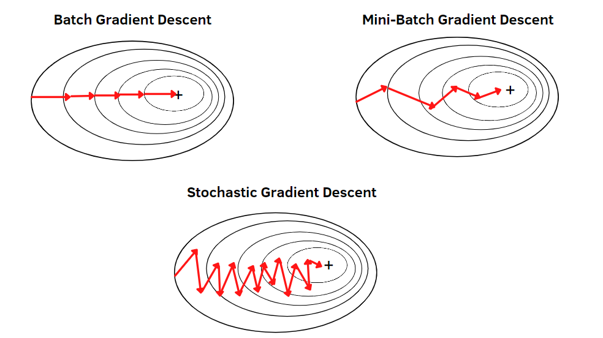

| Variant | Data Used Per Update | Convergence | Notes |
|:---|:---|:---|:---|
| **Batch GD** | Entire dataset | Smooth, slow | Deterministic; cost reduces smoothly; very high computation cost |
| **Stochastic GD (SGD)** | Single sample | Fast but noisy | Lots of variation in cost function; computation time is more |
| **Mini-Batch GD** | Small batch | Balanced | Smoother than SGD; lower compute cost than Batch GD |

**Cost Function – "One Half Mean Squared Error":**

$$J(\theta_0, \theta_1) = \frac{1}{2m} \sum_{i=1}^{m} \left(h_\theta(x^{(i)}) - y^{(i)}\right)^2$$

**Objective:**

$$\min_{\theta_0,\ \theta_1} J(\theta_0, \theta_1)$$

**Update rules:**

$$\theta_0 := \theta_0 - \alpha \frac{\partial}{\partial \theta_0} J(\theta_0, \theta_1)$$

$$\theta_1 := \theta_1 - \alpha \frac{\partial}{\partial \theta_1} J(\theta_0, \theta_1)$$

**Derivatives:**

$$\frac{\partial}{\partial \theta_0} J(\theta_0, \theta_1) = \frac{1}{m} \sum_{i=1}^{m} \left(h_\theta(x^{(i)}) - y^{(i)}\right)$$

$$\frac{\partial}{\partial \theta_1} J(\theta_0, \theta_1) = \frac{1}{m} \sum_{i=1}^{m} \left(h_\theta(x^{(i)}) - y^{(i)}\right) \cdot x^{(i)}$$

`image26.png`
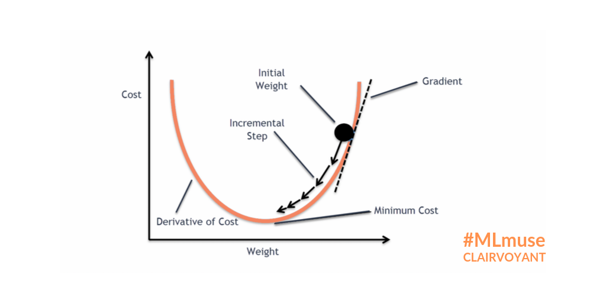

**Batch GD vs Stochastic GD — Comparison:**

| Batch Gradient Descent | Stochastic Gradient Descent |
|:---|:---|
| Computes gradient using the whole training sample | Computes gradient using a single training sample |
| Slow to converge; expensive computation | Faster convergence with lower computation overhead |
| Not applicable to large/huge samples | Can be applied to large samples |
| Deterministic in nature | Stochastic in nature |
| Produces an optimal solution | Produces a good but not necessarily optimal solution |
| No need to shuffle training data | Requires shuffling of training data |
| Can't escape local minima | Can escape local minima |
| Slow convergence | Much faster convergence |
| Weights updated after the entire dataset | Weights updated after each data point |
| Fixed learning rate | Adjustable learning rate |
| Converges to global minimum (convex) / may get stuck in local minimum (non-convex) | May converge to local or global minimum |
| Suffers from overfitting if model is too complex | Helps in reducing overfitting |

---

### 8.2 Optimizers — Full Comparison

| Optimizer | Description | Learning Rate | Memory | Convergence | Pros | Cons |
|:---|:---|:---|:---|:---|:---|:---|
| **Gradient Descent** | Basic, uses full dataset | Fixed | Low | Slow | Simple | Slow for large data |
| **SGD** | Single sample per update | Fixed | Low | Fast | Fast, online learning | High variance, noisy |
| **Mini-batch GD** | Small batch per update | Fixed | Low | Moderate | Reduces variance | Batch size tuning needed |
| **Momentum** | Adds fraction of previous update | Fixed | Moderate | Fast | Reduces oscillations | Momentum param tuning |
| **NAG** | Looks ahead before updating | Fixed | Moderate | Fast | Corrects momentum overshoot | Careful tuning needed |
| **Adagrad** | Per-parameter adaptive LR from past gradients | Decreasing | High | Moderate | Auto LR adjust; good for sparse data | LR shrinks too small |
| **Adadelta** | Limits Adagrad's gradient accumulation | Adaptive | Moderate | Moderate | Fixes Adagrad's LR decay | More complex |
| **RMSprop** | Moving average of squared gradients | Adaptive | Moderate | Fast | Good for non-stationary data | Decay param tuning |
| **Adam** | RMSprop + Momentum combined | Adaptive | High | Fast | Best default choice; adaptive LR | Multiple params to tune |
| **Nadam** | Adam + NAG | Adaptive | High | Fast | Adam benefits + NAG correction | Multiple params |
| **AdaMax** | Adam with infinity norm | Adaptive | High | Fast | Stable; good alternative to Adam | Still needs tuning |
| **SGD + Warm Restarts** | Periodic LR resets | Cyclical | Low | Fast | Escapes local minima | Restart schedule tuning |
| **Lookahead** | "Looks ahead" at future updates | Adaptive | High | Fast | Enhances any base optimizer | Added complexity |

**Summary by category:**
- **Basic**: GD, SGD, Mini-Batch — simple but need extensive tuning
- **Momentum-based**: Momentum, NAG, Lookahead — faster convergence
- **Adaptive LR**: Adagrad, Adadelta, RMSprop, Adam, Nadam, AdaMax — best for most deep learning tasks

---

### 8.3 Hyperparameter Optimization

**Methods (increasing efficiency):**

1. **Manual Search** — try, observe, adjust based on intuition
2. **Grid Search** — exhaustive search over all combinations; independent of past evaluations
3. **Random Search** — random sampling; independent of past evaluations; often better than grid search
4. **Bayesian Optimization** — builds a probability model of objective function; uses past evaluations to guide next search

**Bayesian Optimization (most efficient):**

`image70.png`
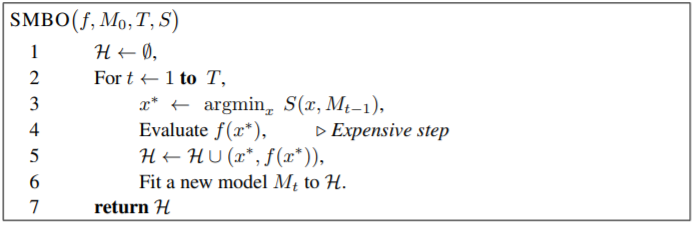

- Builds a **surrogate probabilistic model** of the objective function
- Balances **exploitation** (known good regions) vs **exploration** (uncertain regions)
- Past performance **directly informs** future hyperparameter choices
- Unlike Grid/Random Search which are memoryless

> "Bayesian Optimization is like Manual Search — the performance of past hyperparameter choices affects the future decision."

---

### 8.4 Early Stopping

Stop training once validation performance starts degrading — prevents overfitting by not letting the model over-learn the training data.

---

## 9. Neural Network Fundamentals

### 9.1 Non-Linearity

**Linearity** requires:
1. Homogeneity of degree 1: $f(ax) = af(x)$
2. Additivity: $f(x + y) = f(x) + f(y)$

**Why non-linearity is necessary:**
- Without non-linear activation functions, a deep network collapses into a single linear transformation regardless of depth
- Allows learning complex, non-linear decision boundaries
- Enables approximating any function (Universal Approximation Theorem)

Common non-linear functions: polynomial feature maps, ReLU, Sigmoid, Tanh.

---

### 9.2 Activation Functions

**Desirable Properties:**

| Property | Why It Matters |
|:---|:---|
| **Non-linearity** | Enables modeling non-linear relationships |
| **Differentiable (continuous)** | Required for gradient-based optimization |
| **Bounded range** | Finite range → more stable gradient updates |
| **Monotonic** | Guarantees convex error surface for single-layer models |
| **Approximates identity near origin** | Allows efficient training with small random initial weights |
| **Output symmetric at zero** | Prevents gradients from consistently biasing in one direction |

**Activation Functions Reference:**

`image16.png`
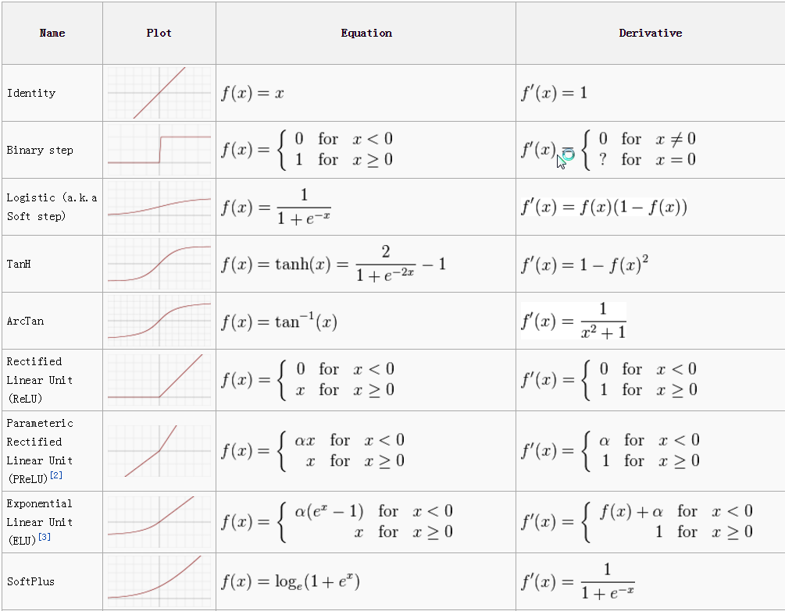

**Common Activation Functions:**

| Function | Formula | Properties |
|:---|:---|:---|
| **Sigmoid** | $\sigma(x) = \frac{1}{1 + e^{-x}}$ | Range (0,1); suffers from saturation/vanishing gradients |
| **Tanh** | $\tanh(x) = \frac{e^x - e^{-x}}{e^x + e^{-x}}$ | Range (-1,1); zero-centered; still saturates |
| **ReLU** | $f(x) = \max(0, x)$ | Fast; no saturation for positive values; dying ReLU problem |
| **Leaky ReLU** | $f(x) = \max(\alpha x, x)$ | Fixes dying ReLU |
| **ELU** | $f(x) = x$ if $x > 0$, else $\alpha(e^x - 1)$ | Smooth; negative values push mean toward zero |

`image20.png`
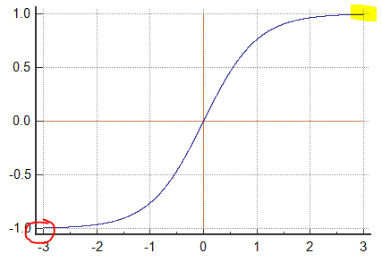

---

### 9.3 Gradient Saturation

When using sigmoid or tanh:
- After training for many epochs, neuron linear parts output very large or small values
- The input to the activation function is far from center → **gradient ≈ 0**
- Weights update extremely slowly → **learning stalls**

**ReLU fix:** No saturation for positive inputs → gradient is constant (1) for $x > 0$, enabling faster convergence with SGD.

> "The biggest advantage of ReLU is non-saturation of its gradient, which greatly accelerates the convergence of stochastic gradient descent compared to sigmoid/tanh."

---

### 9.4 Multi-Layer Perceptron (MLP)

**NN → FFNN → MLP** is a hierarchy from broadest to most specific — each narrows the one before it:

```
Neural Network (NN)              — any network (NN itself allows loops, e.g. RNNs)
   └─ Feed-Forward NN (FFNN)     — data flows one way only, no loops/cycles
        └─ Multilayer Perceptron (MLP) — fully connected + non-linear activations + 3+ layers
```

| | **NN** | **FFNN** | **MLP** |
|:---|:---|:---|:---|
| **Scope** | Broadest — everything | Subset of NN | Subset of FFNN |
| **Loops allowed?** | Yes (e.g. RNNs) | No | No |
| **Connectivity** | Any | Any (as long as forward-only) | Strictly fully connected |
| **Example** | Transformer, RNN | CNN, MLP | Vanilla 3-layer classifier |
| **Analogy** | "Vehicle" | "Land vehicle" | "Sedan" |

**Types of Feed-Forward Networks:** Fully connected MLPs; Fully Convolutional NNs; CNNs + fully connected layers.

**Recurrent Networks (NOT feed-forward — have loops):** Vanilla RNN (suffers from vanishing/exploding gradients), LSTM, GRU, RCNN.

**Memory-Augmented Networks:** Neural Turing Machines (NTM), Differentiable Neural Computers (DNC).

---

### 9.5 Feed-Forward vs Backpropagation

| | Feed-Forward | Backpropagation |
|:---|:---|:---|
| **Purpose** | Compute output from input | Adjust weights by propagating error |
| **Input** | Input vector | Output vector + target output |
| **Output** | Output vector | Adjusted weight vector |
| **When used** | Both training and inference | Only during training |

---

### 9.6 Vanishing & Exploding Gradients

**Vanishing Gradients:**
- Gradients of early layers are products of later-layer gradients
- If later gradients < 1, their product vanishes → early layers learn very slowly
- RNNs particularly susceptible on long sequences
- LSTM was invented to solve this

**Exploding Gradients:**
- Gradients grow exponentially → model produces NaN weights

**Fixes:**

| Problem | Solution |
|:---|:---|
| Vanishing | Weight regularization, use LSTM, use ReLU activations |
| Exploding | Gradient Clipping (cap gradients at a threshold) |

---

### 9.7 Weight Initialization

| Initialization | Best For | Why |
|:---|:---|:---|
| **Xavier (Glorot)** | Sigmoid, Tanh | Keeps variance stable across sigmoid-like layers |
| **He** | ReLU | Accounts for ReLU zeroing half of inputs |

---

### 9.8 Batch Normalization

**Purpose:** Improve performance and stability by normalizing layer inputs to have **mean ≈ 0** and **std ≈ 1**.

**Formula:**

$$h_{\text{norm}} = \frac{h - \mu}{\sqrt{\sigma^2 + \epsilon}}$$

**Placement in network:**
```
CONV/FC → BatchNorm → ReLU (or other activation) → Dropout → CONV/FC
```

**Benefits:**
1. Faster training
2. Acts as regularizer (reduces need for dropout)
3. Improves accuracy
4. Reduces sensitivity to weight initialization

**Batch Norm** normalizes across the **mini-batch** for each feature.

---

### 9.9 Dropout

Approximates training a large number of neural networks with different architectures in parallel.

- Randomly "drops" (sets to zero) neurons during training with probability p
- **Reduces overfitting** by preventing co-adaptation of neurons
- Applied **after the activation layer**

---

## 10. Dimensionality Reduction

### 10.1 PCA vs SVD

**SVD Decomposition:**

$$M_{(m \times n)} = U_{(m \times m)} \cdot \Sigma_{(m \times n)} \cdot V^*_{(n \times n)}$$

Where:
- $M$ = the original matrix being decomposed
- $U$ = left singular matrix; columns are the **left singular vectors** (eigenvectors of $MM^T$)
- $\Sigma$ = diagonal matrix of **singular values** (square roots of eigenvalues of $M^TM$)
- $V^*$ = right singular matrix; columns are the **right singular vectors** (eigenvectors of $M^TM$)

`image9.png`
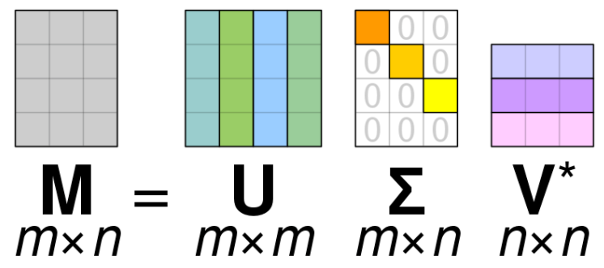

**SVD Derivation:**

$$A^T A = (U\Sigma V^T)^T(U\Sigma V^T) = V\Sigma^T U^T U \Sigma V^T$$

Since $U$ is orthonormal ($U^T U = I$):

$$= V\Sigma^T \Sigma V^T \quad \text{Let } D = \Sigma^T\Sigma$$

$$\boxed{A^T A = V D V^T}$$

| | PCA | SVD |
|:---|:---|:---|
| **What it is** | Finds axes of maximum variance | General matrix factorization |
| **Data** | Centered data matrices | Any matrix (rectangular, sparse) |
| **Connection** | PCA = SVD applied to the mean-centered **data matrix** (equivalently, eigendecomposition of the covariance matrix) | More general than PCA |
| **Goal** | Dimensionality reduction (maximize variance) | Decomposition for various purposes |

---

## 11. Sequential Models

### 11.1 RNN vs LSTM vs GRU

`image5.png`
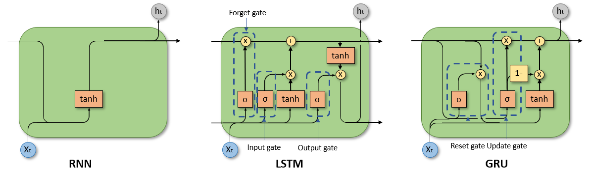

`image84.png`
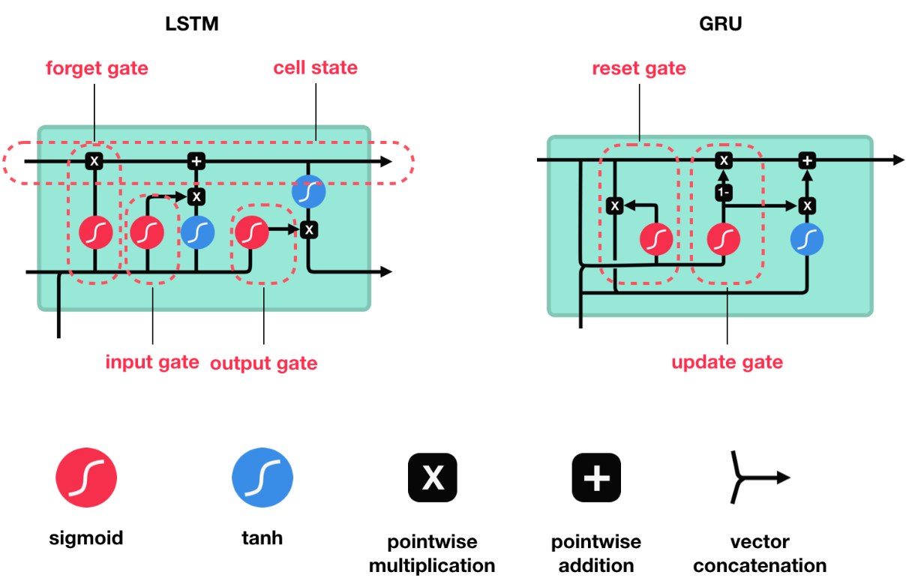

`image31.gif`
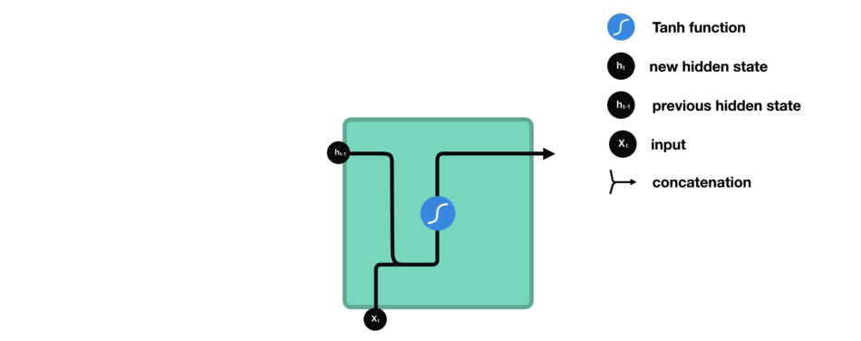

#### Recurrent Neural Networks (RNN)

**Architecture:** Simple cell with tanh, hidden state fed back as input.

**Pros:**
- Simple architecture, easy to implement
- Works well for short sequences

**Cons:**
- **Vanishing gradient problem** — can't learn long-term dependencies
- Limited memory for distant past
- Training instability

#### Long Short-Term Memory (LSTM)

**Three Gates:**

| Gate | Purpose |
|:---|:---|
| **Forget Gate** | Decides what portion of previous cell state to discard |
| **Input Gate** | Decides what new information to store in cell state |
| **Output Gate** | Decides what part of cell state to output as hidden state |

**Pros:**
- Designed for long-term dependencies
- Mitigates vanishing gradient
- Versatile across sequential tasks

**Cons:**
- Complex architecture; more parameters
- Computationally intensive
- Longer training times

#### Gated Recurrent Unit (GRU)

**Two Gates:**

| Gate | Purpose |
|:---|:---|
| **Reset Gate** | Controls how much of previous hidden state to forget |
| **Update Gate** | Balances previous hidden state and new candidate state |

**Pros:**
- Simpler than LSTM — fewer gates, fewer parameters
- Faster training
- Handles long-term dependencies well
- Often matches LSTM performance

**Cons:**
- May not capture all aspects of long-range dependencies as well as LSTM in some cases

#### Summary Comparison

| | RNN | LSTM | GRU |
|:---|:---|:---|:---|
| **Memory** | No explicit | Cell state + gates | Hidden state + 2 gates |
| **Long-term deps** | Poor | Excellent | Good |
| **Complexity** | Low | High | Medium |
| **Training speed** | Fast | Slow | Medium |
| **Best use** | Short sequences | Long sequences, complex tasks | Balanced; efficiency matters |

> **GRU vs LSTM**: GRU controls flow of information without a separate memory unit — it exposes the full hidden state without memory cell control. GRU trains faster and performs better on less training data; LSTM should be preferred when longer sequences need to be remembered.

> **Pixel RNN**: RNNs can be applied to image processing by treating pixels as sequential data.

---

### 11.2 Restricted Boltzmann Machines (RBM)

A variant of Boltzmann machines where neurons form a **bipartite graph**:
- Two groups: **visible units** and **hidden units**
- Connections only between groups (not within)
- Enables efficient training via **contrastive divergence** (gradient-based)

---

### 11.3 Diagonal BiLSTM

`image29.png`
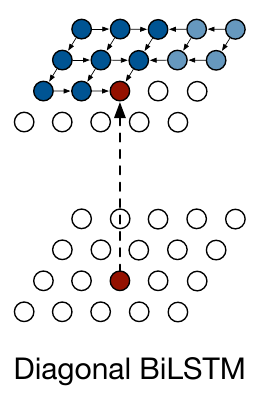

A variant where the LSTM processes input in a diagonal pattern, useful for image generation tasks (e.g., PixelCNN/PixelRNN variants).

---

## 12. NLP & Transformers

### 12.1 Word2Vec

**Loss Functions:**

1. **Skip-gram with Negative Sampling (SGNS)** — most common
   - Objective: Distinguish target word from noise words given a context word
   - Maximizes probability of observed word-context pairs
   - Minimizes probability of randomly sampled noise words

2. **CBOW with Negative Sampling**
   - Context words predict the target word
   - Inverted roles compared to Skip-gram

3. **Hierarchical Softmax**
   - Binary tree over vocabulary
   - Each word = path from root to leaf
   - Maximizes probability of the correct path
   - Reduces computational complexity vs full softmax

**CBOW vs Skip-gram:**

| | CBOW | Skip-gram |
|:---|:---|:---|
| **Task** | Predicts target word from surrounding context words | Predicts context words from a single target word |
| **Speed** | Faster to train | Slower |
| **Rare words** | Better for frequent words | Better for rare words and phrases |
| **When to use** | Large datasets, common words | Rare words, small datasets |

**GloVe vs FastText:**

**GloVe (Global Vectors for Word Representation):**
- Treats words as atomic units (whole-word embeddings only)
- Captures **global co-occurrence statistics** across the entire corpus — how often words appear together globally
- Contrast with Word2Vec which captures co-occurrence one window at a time

**FastText:**
- Extension of Word2Vec — treats words as **bags of character n-grams**
- Can generate embeddings for **out-of-vocabulary (OOV) words** by summing subword n-gram embeddings
- Better for morphologically rich languages and rare words

| | Word2Vec | GloVe | FastText |
|:---|:---|:---|:---|
| **Word unit** | Whole word | Whole word | Character n-grams |
| **Co-occurrence** | One window at a time | Global corpus statistics | One window at a time |
| **OOV handling** | No | No | Yes (subword n-grams) |
| **Best for** | General use | Large corpora, global statistics | Rare/OOV words, morphological languages |

---

### 12.2 Positional Embeddings

Transformers have **no inherent notion of word order** — positional embeddings add this information.

- Word embedding + positional embedding = input to Transformer
- Position embeddings are **fixed** (same regardless of sequence length or input content)
- Values must stay small to avoid shifting word embeddings too far in embedding space
- Alternated **sine** and **cosine** at **increasing frequencies** for each dimension:

$$PE_{(pos, 2i)} = \sin\!\left(\frac{pos}{10000^{2i/d_{model}}}\right)$$

$$PE_{(pos, 2i+1)} = \cos\!\left(\frac{pos}{10000^{2i/d_{model}}}\right)$$

---

### 12.3 QKV Attention Mechanism

Q, K, V are derived from input embeddings via **learned linear transformations**:

$$X \cdot W^Q = Q, \quad X \cdot W^K = K, \quad X \cdot W^V = V$$

| Matrix | Role |
|:---|:---|
| **Query (Q)** | What the current token is "looking for" — used to compute similarity with keys |
| **Key (K)** | What each token "offers" — used to compute attention scores with queries |
| **Value (V)** | The actual content to aggregate — weighted by attention scores |

**Scaled Dot-Product Attention:**

$$\text{Attention}(Q, K, V) = \text{softmax}\!\left(\frac{QK^T}{\sqrt{d_k}}\right) V = Z$$

- $\sqrt{d_k}$ scaling prevents dot products from becoming too large (which causes softmax gradients to vanish)

---

### 12.4 Multi-Head Attention

**Process:**
1. Split input into 8 (or more) heads
2. Each head computes its own Q, K, V projections independently
3. Each head runs scaled dot-product attention → output $Z_i$
4. Concatenate all $Z_i$ matrices
5. Multiply by learned weight matrix $W^O$ → final output

This allows the model to **simultaneously attend to information from different representation subspaces** at different positions.

---

### 12.5 Transformer Architecture

`image83.png`
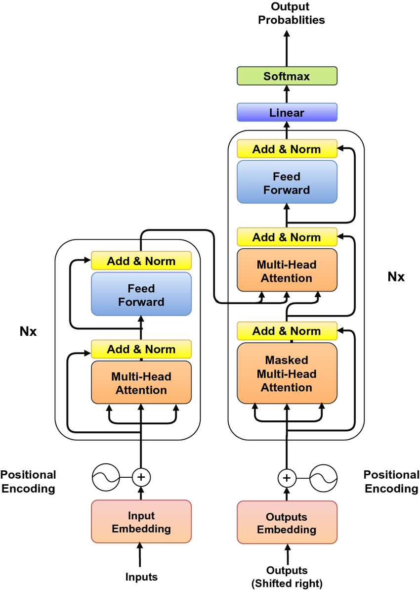

`image11.png`
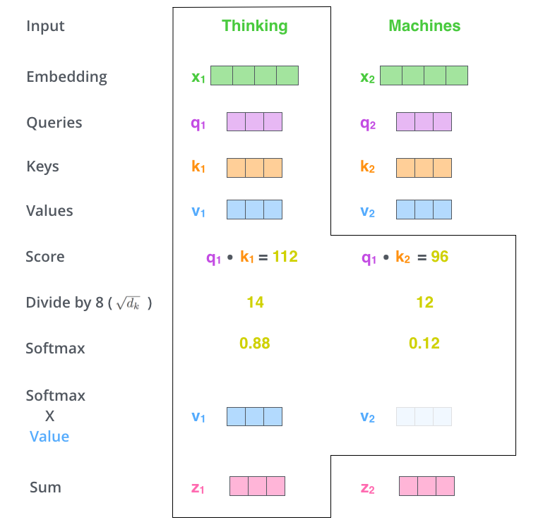

`image60.png`
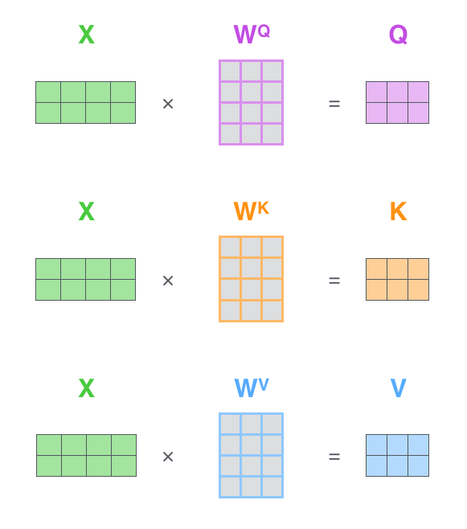

`image1.png`
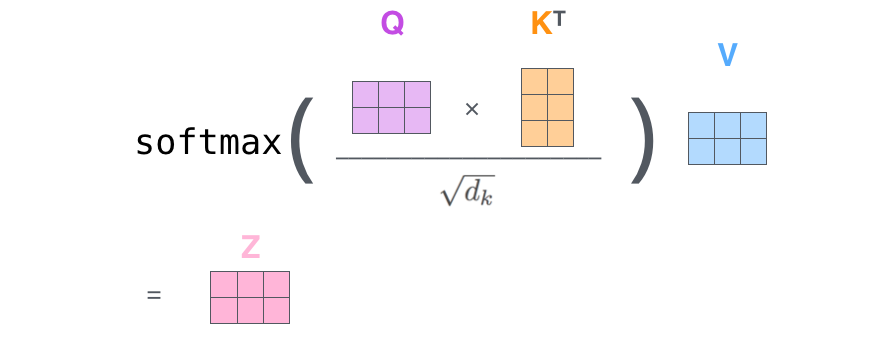

`image28.png`
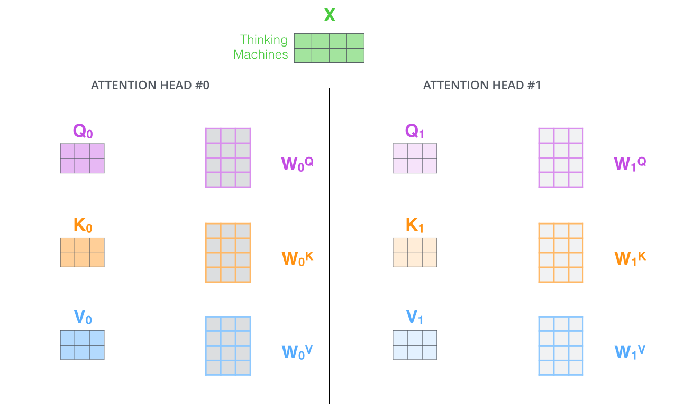

`image48.png`
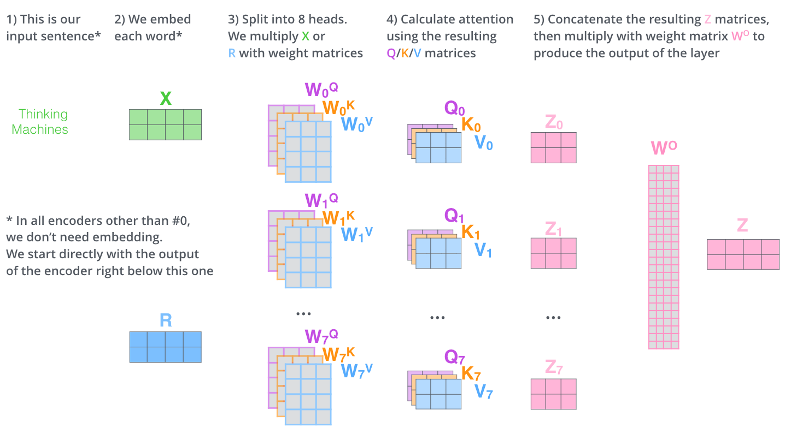

`image8.png`
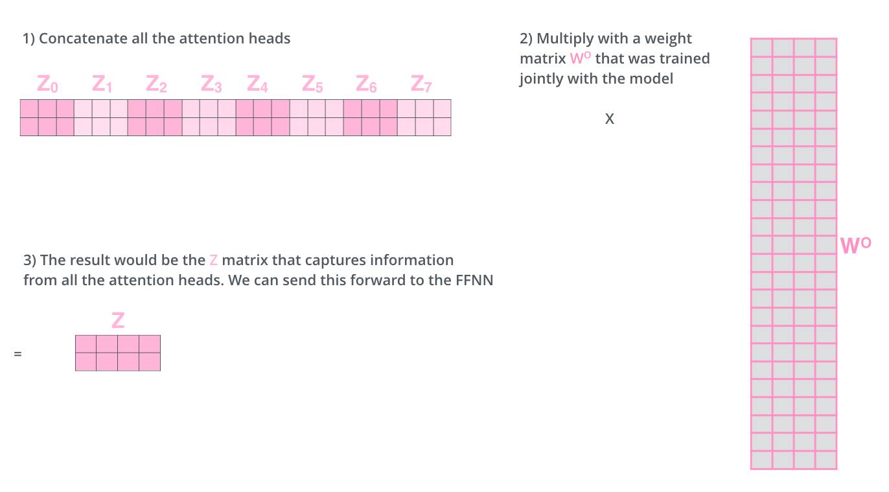

**Encoder:**
```
Input → Embedding + Positional Encoding → [Multi-Head Attention → Add & Norm → Feed Forward → Add & Norm] × N
```

**Decoder:**
```
Output (shifted right) → Embedding + Positional Encoding → [Masked MHA → Add & Norm → Cross-MHA → Add & Norm → Feed Forward → Add & Norm] × N → Linear → Softmax → Output Probabilities
```

---

### 12.6 Self Attention vs Cross Attention

| | Self Attention | Cross Attention |
|:---|:---|:---|
| **Q comes from** | The same input (encoder input) | Decoder output |
| **K, V come from** | The same input | Encoder output |
| **Purpose** | Model relationships within a sequence | Model relationships between encoder and decoder sequences |

---

### 12.7 BERT vs GPT vs BART

| | BERT | GPT | BART |
|:---|:---|:---|:---|
| **Architecture** | Encoder-only | Decoder-only | Encoder-Decoder |
| **Direction** | Bidirectional | Unidirectional (left-to-right) | Both |
| **Pre-training** | Masked LM (MLM) + Next Sentence Prediction | Autoregressive (causal) language modeling | Denoising autoencoder — text infilling (spans, incl. zero-length, → a single [MASK]) + sentence permutation ("Span Corruption" is T5's term) |
| **Fine-tuning** | Task-specific layer added on top | Few-shot prompting; one-shot adaptation | Versatile for various NLP tasks |
| **Best for** | Classification, NER, Q&A, Word Classification | Text generation, Text completion, creative writing | Translation, Summarisation, Question & Answer |
| **Original org** | Google AI | OpenAI | Facebook AI |

---

### 12.8 KL Divergence

Measures how one probability distribution **diverges** from a reference distribution:

$$D_{KL}(p \| q) = \sum_{x \in X} p(x) \ln\!\frac{p(x)}{q(x)}$$

**Applications:**
- Measuring difference between two distributions
- In RLHF: comparing initial LM output vs fine-tuned LM output to prevent over-divergence
- VAE: KL term regularizes latent space toward standard normal

---

### 12.9 LLaMA Pre-training & RLHF

**Pre-training Loss:** Standard **cross-entropy loss** over next-token prediction:

$$\mathcal{L} = -\sum_{i=1}^{N} y_i \log \hat{y}_i$$

where $y_i$ is one-hot (correct token = 1, others = 0) and $\hat{y}_i$ is predicted probability distribution.

**Training Process:**
1. Model predicts next token given previous tokens
2. Cross-entropy loss is computed
3. Gradients propagated; weights updated via Adam/SGD variants
4. This enables learning statistical properties of language → fine-tunable for downstream tasks

**RLHF Pipeline (LLaMA 2):**

`image51.jpg`
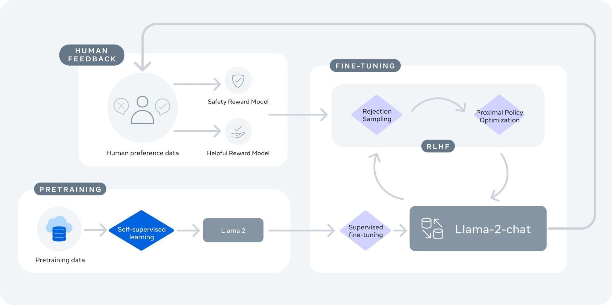

1. **Pre-training**: Self-supervised learning → LLaMA 2 base
2. **Supervised Fine-Tuning (SFT)**: Human-labeled demonstrations
3. **Reward Modeling**: Human preference data → reward model
4. **RLHF / PPO**: Fine-tune with RL using reward signal → LLaMA-2-Chat

---

## 13. Advanced Topics

### 13.1 Expectation Maximization (EM)

An iterative algorithm to find parameters of latent variable models (e.g., Gaussian Mixture Models).

**Key Idea:** Given the number of Gaussians, find their parameters (mean and variance).

**EM vs K-Means:**
- K-Means: **hard** assignment (each point belongs to exactly one cluster)
- EM: **soft** assignment (each point has a *probability* of belonging to each cluster)

`image54.png`
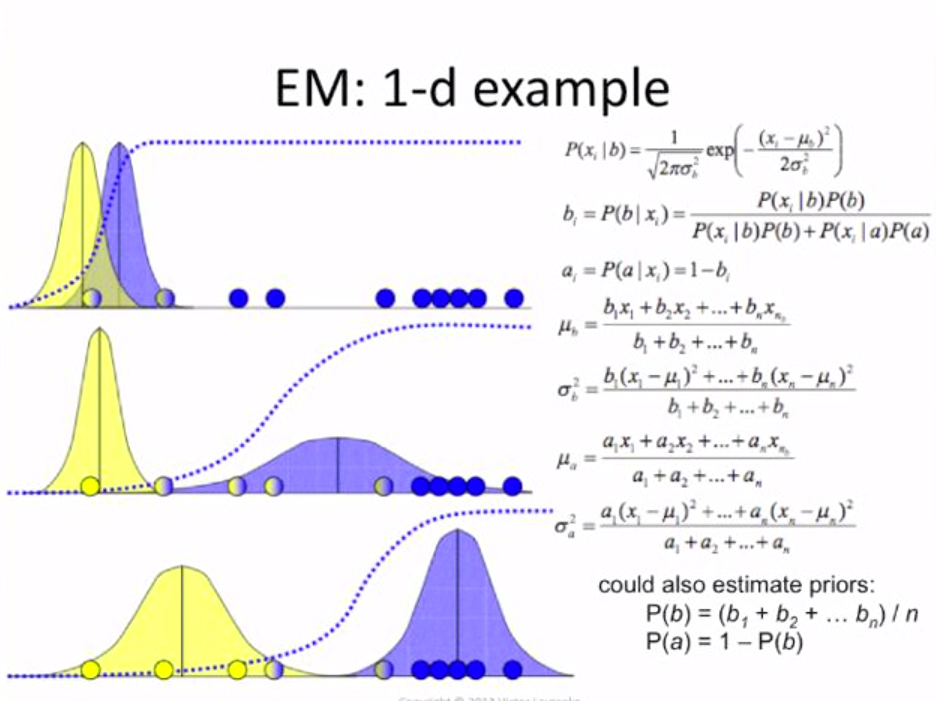

`image30.png`
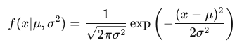

**Steps:**
1. **Initialize**: Random mean and variance for each Gaussian
2. **E-step** (Expectation): Compute probability of each point belonging to each Gaussian
3. **M-step** (Maximization): Update means and variances using weighted probabilities
4. Repeat until convergence

---

### 13.2 MLE vs EM

| | MLE | EM |
|:---|:---|:---|
| **Approach** | Accumulates all data first, then finds best-fit model | Takes initial parameter guess, then iterates using observed + inferred data |
| **Use case** | Fitting one distribution to observed data | Fitting mixture of distributions when class labels are unknown |
| **Example** | Find μ, σ of a single Gaussian | Fit K Gaussians without knowing which cluster each point belongs to |

---

### 13.3 Knowledge Distillation

Transferring knowledge from a large **teacher** model to a smaller **student** model.

`image18.jpg`
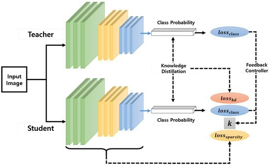

**Process:**
- Teacher produces **soft probability outputs** (richer signal than hard labels)
- Student learns from: class loss + KD loss (from teacher's soft outputs) + certainty loss
- Result: Compact model that approximates the teacher's performance

---

### 13.4 Model Drift

**Definition:** Changes in a model's predictions over time due to changes in inputs, outputs, or ground truths.

**Types:**

| Type | Definition | Resolution |
|:---|:---|:---|
| **Prediction Drift** | Model predictions change over time | Retrain or replace model |
| **Concept Drift** | Statistical properties of target variable shift | Reweight data, refit model |
| **Data Drift** | Statistical properties of input data change | Update model; monitor inputs |
| **Upstream Drift** | Changes in the data pipeline (missing values, feature cardinality) | Monitor data quality |

---

### 13.5 Model Calibration

Finding a unique set of model parameters that provide a **good description of the system behaviour** by comparing model predictions against actual measurements.

A well-calibrated model's predicted probabilities accurately reflect true likelihoods (e.g., events predicted at 70% probability actually occur ~70% of the time).

---

### 13.6 Exploration vs Exploitation

The fundamental tradeoff in reinforcement learning and bandit problems:

| | Exploration | Exploitation |
|:---|:---|:---|
| **Action** | Try new/uncertain options to gain information | Use known best option to maximize reward |
| **Risk** | May be suboptimal short-term | May miss better long-term options |

**Strategies:**
- **ε-greedy**: Decides what fraction ε of decisions to spend exploring (trying new options) and fraction (1-ε) exploiting the best known option
- **UCB (Upper Confidence Bound)**: Selects the action with the highest upper confidence bound $\mu + \beta\sigma$, where $\beta$ is a trade-off parameter. High $\beta$ favors exploration; $\beta \to 0$ approaches pure exploitation
- **Thompson Sampling**: Draw one sample from each action's posterior distribution of expected reward. Rank actions based on sampled reward values and select the highest

---

### 13.7 Valence Shifters

Modifiers in sentiment analysis that alter the polarity or intensity of sentiment-bearing words:

| Type | Effect | Examples |
|:---|:---|:---|
| **Negations** | Flip sentiment polarity | "not good", "never bad" |
| **Intensifiers** | Amplify sentiment strength | "very good", "extremely poor" |
| **Diminishers** | Weaken sentiment strength | "somewhat good", "barely bad" |

---

## 14. Amazon Applied Scientist Interview Topics

Expect to be asked about data-driven modeling, train/test protocols, error analysis, and statistical significance.

### 14.1 Frequently Asked Question Topics

Specific topics that have come up in Amazon Applied Scientist interviews:

- Linear regression model
- SVM loss function
- Gradient saturation
- Regularization methods in DNNs
- GMM — EM algorithm
- Model tuning and evaluation metrics
- Matrix factorization methods
- SVD and eigendecomposition
- Boosting
- Explore/exploit strategies
- Model calibration
- Supervised learning
- Tree-based models
- Bagging vs Boosting
- Evaluation metrics
- Deep learning
- Non-parametric models
- Skip-gram, CBOW, GloVe, FastText
- LSTM and GRU
- Batch normalization
- XGBoost and GBM

### 14.2 Topics by Area

**Supervised Learning**
- Linear regression, Logistic regression
- Random Forest, Gradient Boosted Trees (GBT)
- K-Nearest Neighbors (KNN), Naive Bayes
- Kernel methods, Bayesian linear regression, Gaussian Processes (GP)
- SGD, regularization (L1/L2)

**Deep Neural Networks**
- Feedforward NNs, CNNs, Backpropagation
- RNNs, LSTMs, GRUs

**Unsupervised Learning**
- Clustering algorithms
- Expectation Maximization (EM), Gaussian Mixture Models (GMMs)
- Evaluation metrics for unsupervised tasks

**Probabilistic Graphical Models (PGM)**
- Latent Dirichlet Allocation (LDA)
- Belief Propagation
- Gibbs Sampling
- Variational Inference

**Dimensionality Reduction**
- PCA, SVD
- Spectral Clustering
- Matrix Factorization

**Sequential Models**
- Conditional Random Fields (CRFs)
- Hidden Markov Models (HMMs)
- NER (Named Entity Recognition), POS tagging

**Reinforcement Learning**
- Explore-exploit tradeoff
- Multi-armed bandits: ε-greedy, UCB, Thompson Sampling
- Q-learning
- Deep Q-Networks (DQNs)

---

## References

**Evaluation Metrics**
- [Tour of Evaluation Metrics for Imbalanced Classification — Machine Learning Mastery](https://machinelearningmastery.com/tour-of-evaluation-metrics-for-imbalanced-classification/)
- [ROC and AUC, Clearly Explained! — StatQuest (YouTube)](https://www.youtube.com/watch?v=4jRBRDbJemM)

**Loss Functions**
- [Loss Functions Overview — vinija.ai](https://vinija.ai/concepts/loss/)

**Optimization**
- [An Overview of Gradient Descent Optimization Algorithms — Sebastian Ruder](https://ruder.io/optimizing-gradient-descent/)

**Backpropagation**
- [Back Propagation is Very Simple — Medium (@14prakash)](https://medium.com/@14prakash/back-propagation-is-very-simple-who-made-it-complicated-97b794c97e5c)

**Activation Functions**
- [Activation Functions in Neural Networks — Towards Data Science](https://towardsdatascience.com/activation-functions-neural-networks-1cbd9f8d91d6)

**Feature Scaling**
- [Feature Scaling in Machine Learning — Analytics Vidhya](https://www.analyticsvidhya.com/blog/2020/04/feature-scaling-machine-learning-normalization-standardization/)

**Ensemble Methods**
- [Implementing AdaBoost from Scratch — GeeksForGeeks](https://www.geeksforgeeks.org/implementing-the-adaboost-algorithm-from-scratch/)

**Dimensionality Reduction**
- [Linear Discriminant Analysis for Machine Learning — KnowledgeHut](https://www.knowledgehut.com/blog/data-science/linear-discriminant-analysis-for-machine-learning)

**Reinforcement Learning**
- [Upper Confidence Bound — JMLR Vol. 3 (Auer et al.)](http://jmlr.org/papers/volume3/auer02a/auer02a.pdf)

**Transformers**
- [The Illustrated Transformer — Jay Alammar](https://jalammar.github.io/illustrated-transformer/)

**BERT / XLNet**
- [The Illustrated BERT — Jay Alammar](http://jalammar.github.io/illustrated-bert/)
- [NLP: BERT & Transformer — Jonathan Hui](https://jonathan-hui.medium.com/nlp-bert-transformer-7f0ac397f524)
- [Two-Stream Self-Attention in XLNet — Towards Data Science](https://towardsdatascience.com/what-is-two-stream-self-attention-in-xlnet-ebfe013a0cf3)

**SVM**
- [SVM with Kernels Lecture Notes — Northeastern University](https://www.ccs.neu.edu/home/vip/teach/MLcourse/6_SVM_kernels/lecture_notes/svm/svm.pdf)

**RNNs / LSTMs**
- [The Fall of RNN / LSTM — Towards Data Science](https://towardsdatascience.com/the-fall-of-rnn-lstm-2d1594c74ce0)
- [Disadvantages of RNN — Quora](https://www.quora.com/What-are-the-disadvantages-of-a-recurrent-neural-network)
- [What's the catch with LSTM — Data Science Stack Exchange](https://datascience.stackexchange.com/questions/27392/so-whats-the-catch-with-lstm)

**Hypothesis Testing**
- [Hypothesis Testing — Stattrek](https://stattrek.com/hypothesis-test/hypothesis-testing.aspx)

**Interview Preparation**
- [Deep Learning Interview Questions — Simplilearn](https://www.simplilearn.com/tutorials/deep-learning-tutorial/deep-learning-interview-questions)
- [Deep Learning Interview Questions — JavaTPoint](https://www.javatpoint.com/deep-learning-interview-questions)
- [Machine Learning Interview Questions — Springboard](https://www.springboard.com/blog/machine-learning-interview-questions/)

**Coding Practice (GeeksForGeeks)**
- [Find Number of Islands](https://www.geeksforgeeks.org/find-number-of-islands/)
- [Longest Increasing Subsequence](https://www.geeksforgeeks.org/longest-increasing-subsequence-dp-3/)
- [Sort Array in Wave Form](https://www.geeksforgeeks.org/sort-array-wave-form-2/)
- [Tree Traversals (Inorder, Preorder, Postorder)](https://www.geeksforgeeks.org/tree-traversals-inorder-preorder-and-postorder/)
- [Longest Common Subsequence](https://www.geeksforgeeks.org/longest-common-subsequence-dp-4/)
- [Partition Problem](https://www.geeksforgeeks.org/partition-problem-dp-18/)
- [Largest Sum Contiguous Subarray (Kadane's Algorithm)](https://www.geeksforgeeks.org/largest-sum-contiguous-subarray/)
- [Find First Repeated Character in a String](https://www.geeksforgeeks.org/find-the-first-repeated-character-in-a-string/)

**General ML Resources**
- [Aman's AI Notes](https://aman.ai/)
- [Vinija AI Concepts](https://vinija.ai/)
- [Vinija AI Concepts Library](https://vinija.ai/concepts/)

### Further Reading & Saved Resources

*Imported from saved bookmarks, grouped by topic.*

**Courses & Books**
- [CS229: Machine Learning — Syllabus (Stanford)](http://cs229.stanford.edu/syllabus.html)
- [CS229 — Stanford Engineering Everywhere (full course)](https://see.stanford.edu/Course/CS229)
- [CS229 — Course Projects (Fall 2017)](http://cs229.stanford.edu/proj2017/)
- [Machine Learning — Andrew Ng (Coursera)](https://www.coursera.org/learn/machine-learning/home/week/1)
- [Machine Learning Lecture 3 — Andrew Ng (Stanford, YouTube)](https://www.youtube.com/watch?v=HZ4cvaztQEs&list=PLA89DCFA6ADACE599&index=3)
- [Multivariable Derivatives — Khan Academy](https://www.khanacademy.org/math/multivariable-calculus/multivariable-derivatives/modal/v/directional-derivatives-and-slope)
- [Deep Learning Book — Goodfellow, Bengio & Courville](http://www.deeplearningbook.org/)
- [Deep Learning Book — Companion Videos (YouTube)](https://www.youtube.com/playlist?list=PLsXu9MHQGs8df5A4PzQGw-kfviylC-R9b)
- [PyTorch Deep Learning — Alfredo Canziani (NYU)](https://atcold.github.io/pytorch-Deep-Learning/)
- [Tom Mitchell — Home Page (CMU)](http://www.cs.cmu.edu/~tom/)
- [10-701/15-781 Machine Learning — CMU](http://www.cs.cmu.edu/~epxing/Class/10701-08f/project.html)
- [applied-ml — Curated Industry ML Resources (Eugene Yan)](https://github.com/eugeneyan/applied-ml)
- [Scipy Lecture Notes](http://www.scipy-lectures.org/)

**Data Science & ML Interviews**
- [Top 30 Data Science Interview Questions — Towards Data Science](https://towardsdatascience.com/top-30-data-science-interview-questions-7dd9a96d3f5c)
- [Cracking the Data Scientist Interview — KDnuggets](https://www.kdnuggets.com/2019/01/cracking-data-scientist-interview.html)
- [Apple AI Interview Questions — Acing the AI Interview](https://medium.com/acing-ai/apple-ai-interview-questions-acing-the-ai-interview-803a65b0e795)
- [Everything You Need to Know About Neural Networks — Hackernoon](https://hackernoon.com/everything-you-need-to-know-about-neural-networks-8988c3ee4491)
- [Cheat Sheets for AI, ML, DL & Big Data — Becoming Human](https://becominghuman.ai/cheat-sheets-for-ai-neural-networks-machine-learning-deep-learning-big-data-678c51b4b463)
- [Machine Learning Archives — MonkeyLearn Blog](https://monkeylearn.com/blog/category/machine-learning/)

**Optimization & Training**
- [The Vanishing Gradient Problem — Towards Data Science](https://towardsdatascience.com/the-vanishing-gradient-problem-69bf08b15484)
- [A Gentle Introduction to Exploding Gradients — Machine Learning Mastery](https://machinelearningmastery.com/exploding-gradients-in-neural-networks/)
- [Batch Normalization: Theory and TensorFlow — Towards Data Science](https://towardsdatascience.com/batch-normalization-theory-and-how-to-use-it-with-tensorflow-1892ca0173ad)
- [Why Internal Covariate Shift Slows Training — Quora](https://www.quora.com/Why-does-an-internal-covariate-shift-slow-down-the-training-procedure)
- [Loss Functions in Deep Learning — yeephycho](http://yeephycho.github.io/2017/09/16/Loss-Functions-In-Deep-Learning/)
- [L1 vs L2 as Loss Function and Regularization — chioka.in](http://www.chioka.in/differences-between-l1-and-l2-as-loss-function-and-regularization/)

**Bias–Variance**
- [Bias-Variance Tradeoff (Lecture 12) — Cornell CS4780](http://www.cs.cornell.edu/courses/cs4780/2018fa/lectures/lecturenote12.html)
- [Bias–Variance Tradeoff — Wikipedia](https://en.wikipedia.org/wiki/Bias%E2%80%93variance_tradeoff)

**Classical ML**
- [MLE vs MAP — Zhiya Zuo](https://zhiyzuo.github.io/MLE-vs-MAP/)
- [Introduction to Naive Bayes (YouTube)](https://www.youtube.com/watch?v=sjUDlJfdnKM)
- [A Practical Explanation of a Naive Bayes Classifier — MonkeyLearn](https://monkeylearn.com/blog/practical-explanation-naive-bayes-classifier/)
- [Decision Trees in Machine Learning — Towards Data Science](https://towardsdatascience.com/decision-trees-in-machine-learning-641b9c4e8052)
- [Why Bother with the Dual Problem When Fitting SVM? — Cross Validated](https://stats.stackexchange.com/questions/19181/why-bother-with-the-dual-problem-when-fitting-svm)

**Probability & Linear Algebra**
- [Distribution Functions — HyperPhysics](http://hyperphysics.phy-astr.gsu.edu/hbase/Math/disfcn.html#c2)
- [Multinomial Distribution — Stattrek](https://stattrek.com/probability-distributions/multinomial.aspx)
- [Real-Life Examples for Eigenvalues / Eigenvectors — Mathematics Stack Exchange](https://math.stackexchange.com/questions/1520832/real-life-examples-for-eigenvalues-eigenvectors)
- [What Do Eigenvalues and Eigenvectors Represent Intuitively? — Quora](https://www.quora.com/What-do-eigenvalues-and-eigenvectors-represent-intuitively-What-is-their-significance)
- [A Simple Explanation of Eigenvectors and Eigenvalues — Mathematics Stack Exchange](https://math.stackexchange.com/questions/36815/a-simple-explanation-of-eigenvectors-and-eigenvalues-with-big-picture-ideas-of)

**Clustering & Topic Models**
- [Determining the Number of Clusters in a Data Set — Wikipedia](https://en.wikipedia.org/wiki/Determining_the_number_of_clusters_in_a_data_set)
- [Non-parametric Clustering with Dirichlet Processes — Univ. at Buffalo (PDF)](https://cse.buffalo.edu/~jcorso/t/2009S_555/files/lecture7.dirichlet.pdf)
- [LDA (Latent Dirichlet Allocation) Algorithm — YouTube](https://www.youtube.com/watch?v=DWJYZq_fQ2A)

**CNNs & Object Detection**
- [R-CNN vs Fast R-CNN — Quora](https://www.quora.com/What-is-the-difference-between-R-CNN-and-Fast-R-CNN)
- [Fast R-CNN and Faster R-CNN — Jonathan Hui](https://jhui.github.io/2017/03/15/Fast-R-CNN-and-Faster-R-CNN/)
- [From R-CNN to Faster R-CNN: The Evolution of Object Detection — Alibaba Cloud](https://medium.com/@Alibaba_Cloud/from-r-cnn-to-faster-r-cnn-the-evolution-of-object-detection-technology-8fcf46029397)
- [SSD: Single Shot MultiBox Detector — ShortScience](https://www.shortscience.org/paper?bibtexKey=conf/eccv/LiuAESRFB16)
- [Understanding SSD MultiBox — Towards Data Science](https://towardsdatascience.com/understanding-ssd-multibox-real-time-object-detection-in-deep-learning-495ef744fab)
- [How Does the Single-Shot MultiBox Detector (SSD) Work? — Quora](https://www.quora.com/How-does-the-Single-Shot-MultiBox-Detector-SSD-really-work)
- [SSD Explained — Manish Chablani (Medium)](https://medium.com/@ManishChablani/ssd-single-shot-multibox-detector-explained-38533c27f75f)

**Generative Models**
- [What Is a GAN? — Jonathan Hui](https://medium.com/@jonathan_hui/gan-whats-generative-adversarial-networks-and-its-application-f39ed278ef09)
- [What Is a Variational Autoencoder? — Jaan Altosaar](https://jaan.io/what-is-variational-autoencoder-vae-tutorial/)
- [InfoGAN — GANs Part III — Towards Data Science](https://towardsdatascience.com/infogan-generative-adversarial-networks-part-iii-380c0c6712cd)

**NLP & Transformers**
- [Self-Attention Mechanisms in NLP — Alibaba Cloud (Medium)](https://medium.com/@Alibaba_Cloud/self-attention-mechanisms-in-natural-language-processing-9f28315ff905)
- [Understanding Encoder-Decoder Seq2Seq Models — Towards Data Science](https://towardsdatascience.com/understanding-encoder-decoder-sequence-to-sequence-model-679e04af4346)

**RNNs / LSTMs**
- [Stateful vs Stateless LSTM for Time-Series Forecasting — Machine Learning Mastery](https://machinelearningmastery.com/stateful-stateless-lstm-time-series-forecasting-python/)

**Reinforcement Learning**
- [Meta Reinforcement Learning (RL²) — Hackernoon](https://hackernoon.com/learning-policies-for-learning-policies-meta-reinforcement-learning-rl%C2%B2-in-tensorflow-b15b592a2ddf)

**Explainable AI**
- [Interpretable AI — Towards Data Science](https://towardsdatascience.com/interpretable-ai-or-how-i-learned-to-stop-worrying-and-trust-ai-e61f9e8ee2c2)
- ["Explainable AI": Who Takes the Decisions for Us? — Towards Data Science](https://towardsdatascience.com/explainable-ai-who-takes-the-decisions-for-us-97b1d33edd91)

**Coding & DSA Practice**
- [LeetCode — Problem Set](https://leetcode.com/problemset/all/)
- [HackerRank — Dashboard](https://www.hackerrank.com/dashboard)
- [HackerRank — Interview Prep Contest](https://www.hackerrank.com/contests/pep-interviewprep-9june/challenges)
- [HackerEarth — Coding Challenges](https://www.hackerearth.com/challenges/)
- [GeeksforGeeks — Placements](https://www.geeksforgeeks.org/placements-gq/)
- [The Top Data Structures for Your Next Coding Interview — freeCodeCamp](https://medium.freecodecamp.org/the-top-data-structures-you-should-know-for-your-next-coding-interview-36af0831f5e3)
- [Data Structures Essay — hexapodia (Web Archive)](https://web.archive.org/web/20111223104325/http://essays.hexapodia.net/datastructures)
- [Python Programs — OmkarPathak (GitHub)](https://github.com/OmkarPathak/Python-Programs)
- [Beginning Java: Data Types, Variables, and Arrays — SitePoint](https://www.sitepoint.com/beginning-java-data-types-variables-and-arrays/)
- [C Storage Classes — Guru99](https://www.guru99.com/c-storage-classes.html)

**Tools & Miscellaneous**
- [How to Rewrite Your SQL Queries in Pandas — Medium](https://medium.com/jbennetcodes/how-to-rewrite-your-sql-queries-in-pandas-and-more-149d341fc53e)
- [TensorFlow — Convolutional VAE Example (GitHub)](https://github.com/tensorflow/tensorflow/blob/r1.13/tensorflow/contrib/eager/python/examples/generative_examples/cvae.ipynb)
- [Design Rule Checks (DRC) for 28nm Technology — Design & Reuse](https://www.design-reuse.com/articles/41504/design-rule-checks-drc-a-practical-view-for-28nm-technology.html)
- [Student Perspectives on Applying to NLP PhD Programs — Nelson Liu](https://blog.nelsonliu.me/2019/10/24/student-perspectives-on-applying-to-nlp-phd-programs/)

**Careers & Job Boards**
- [Tesla — Careers](https://www.tesla.com/careers/search)
- [Gartner — Jobs and Careers](https://jobs.gartner.com/)
- [StepStone — Job Exchange (DE)](https://www.stepstone.de/)
- [Joblift (DE)](https://joblift.de/)
- [Absolventa — Jobs for Graduates (DE)](https://www.absolventa.de/)
- [Jobs in Berlin for English Speakers](http://www.jobsinberlin.eu/search?q=data+science)
- [BambooHR — Jobs](https://fcg.bamboohr.com/jobs/)
- [XING](https://www.xing.com/home)
- [Hays — UK Jobs and Recruitment](https://www.hays.co.uk/)
- [BearingPoint (DE)](https://www.bearingpoint.com/de-de/)
- [neuvoo — Job Search](https://neuvoo.com/)
- [bigshyft — Job Search](https://www.bigshyft.com/jobs)
- [Jobbio — Job Search](https://jobbio.com/search)
- [AngelList / Wellfound](https://angel.co/)

---

*Notes compiled from ML/DL interview preparation materials. Topics cover Statistics, Classical ML, Deep Learning, NLP/Transformers, and Advanced Methods.*
