# Image Reference — ML/DL Formulas

---

## Eigenvector Calculation
`image3.gif`
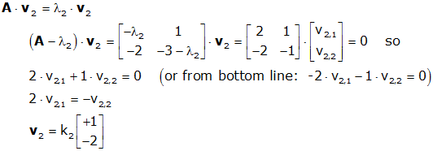

---

## GD Cost Function + Update Rules
`image6.png`
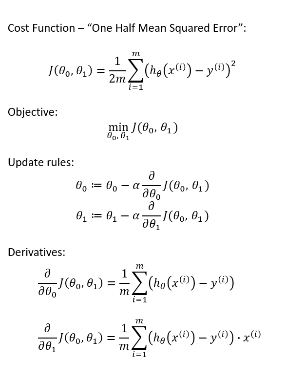

---

## Triplet Loss Formula
`image12.png`
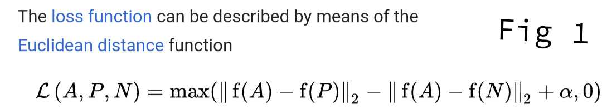

---

## Accuracy / Precision / Recall
`image14.png`
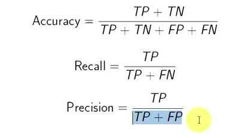

---

## BERT / GPT / BART Table
`image15.png`
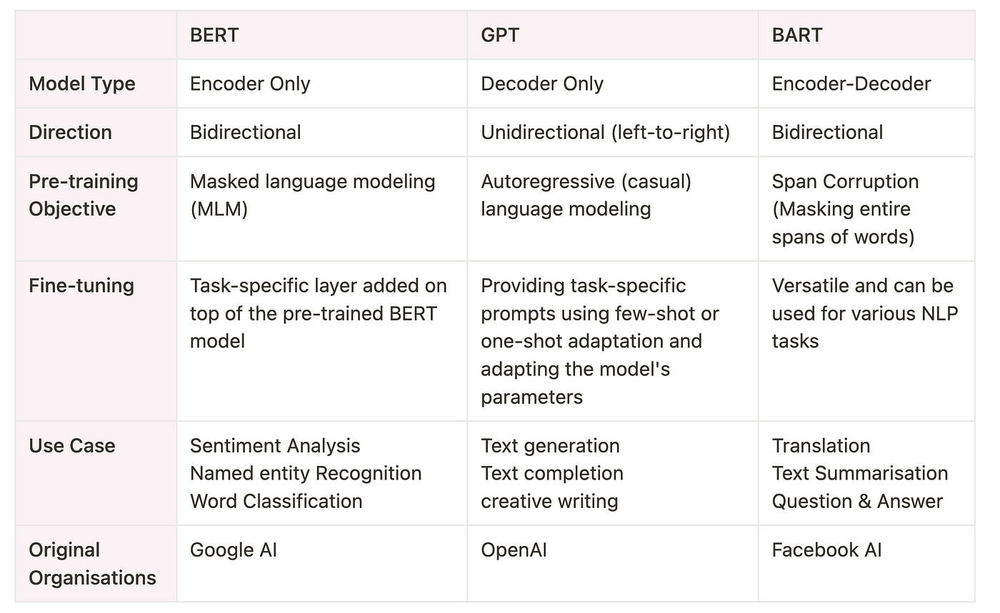

---

## Eigenvector Constraint
`image17.gif`
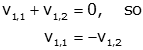

---

## Bagging vs Boosting Table
`image19.png`
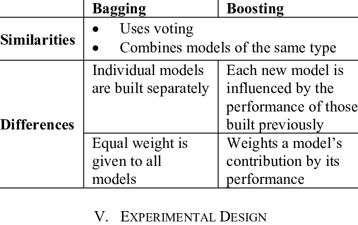

---

## F-Beta Formula
`image23.jpg`
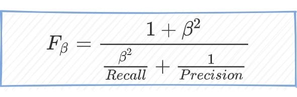

---

## Micro / Macro Formulas
`image32.png`
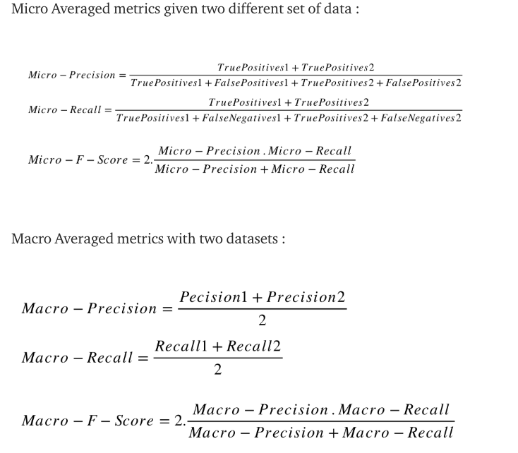

---

## KL Divergence Formula
`image33.png`
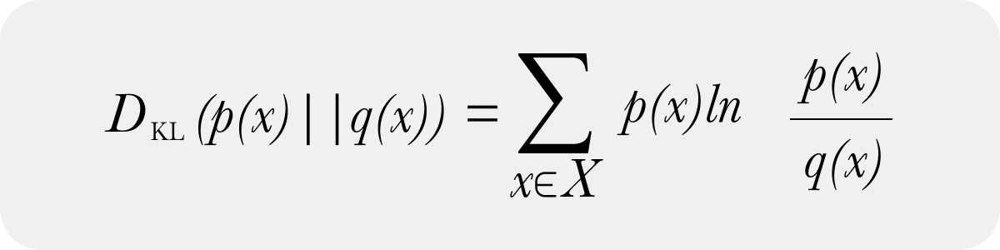

---

## MAP → MLE Derivation
`image39.jpg`
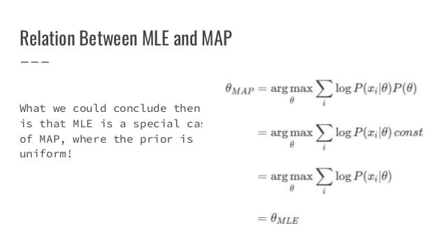

---

## 10 Loss Functions Table
`image41.jpg`
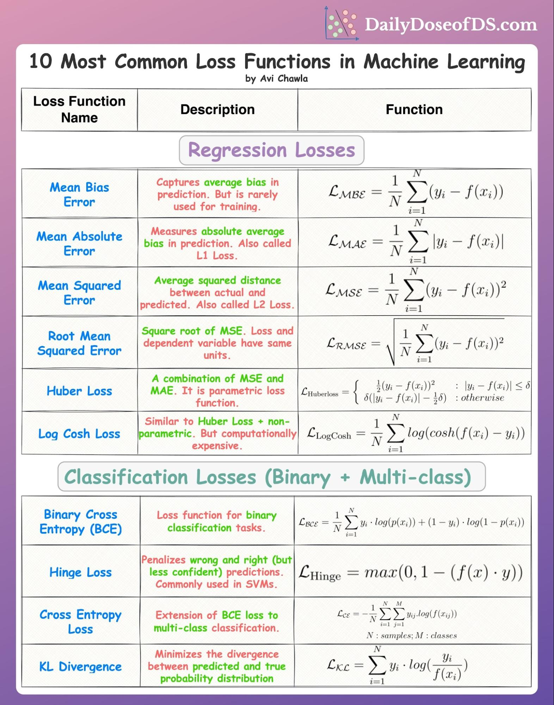

---

## L1 vs L2 (8 rows)
`image45.png`
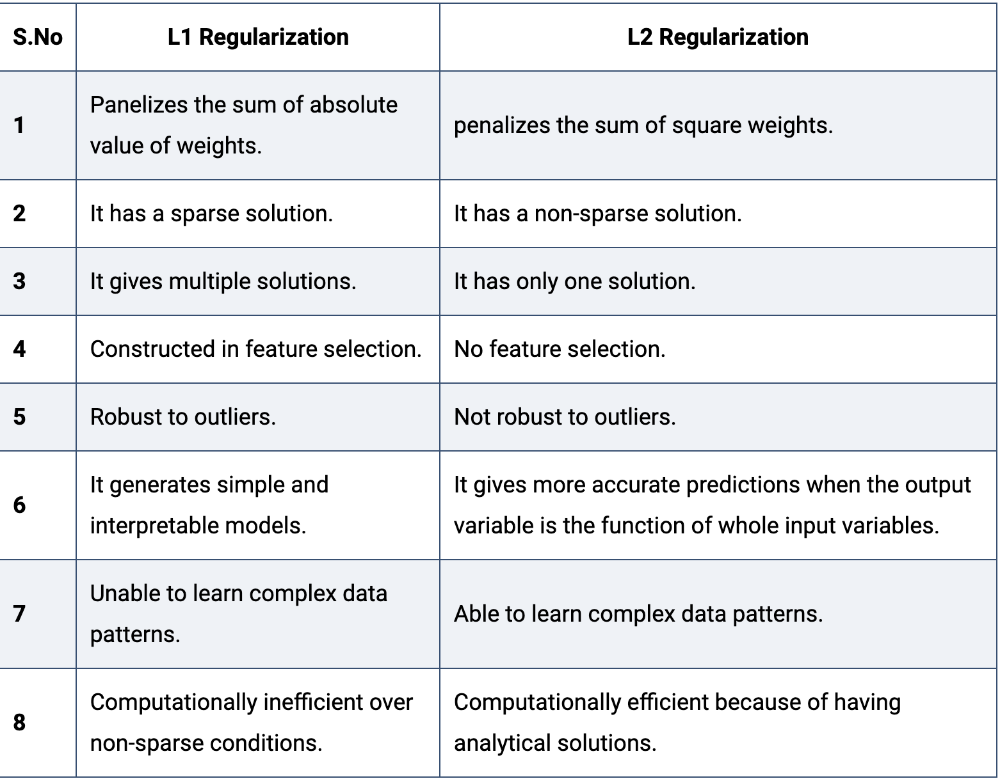

---

## Characteristic Polynomial
`image46.gif`
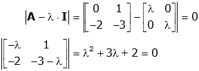

---

## F1 Harmonic Mean Form
`image47.png`
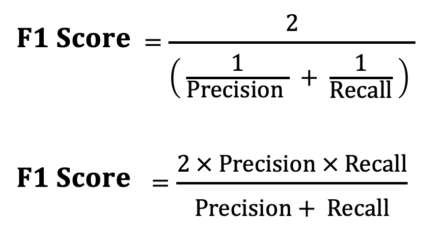

---

## Covariance Formula
`image57.png`
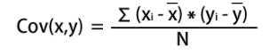

---

## SVD Derivation
`image59.png`
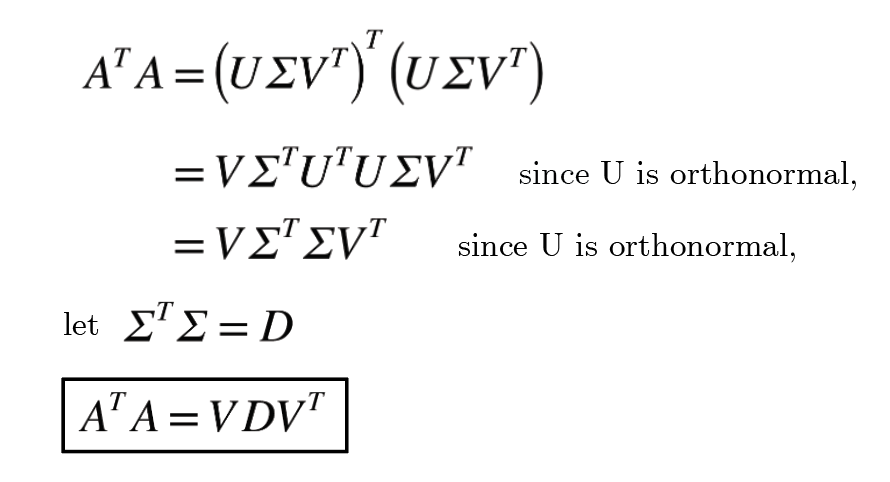

---

## Correlation Formula
`image61.png`
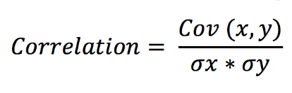

---

## ERM Formula
`image67.png`
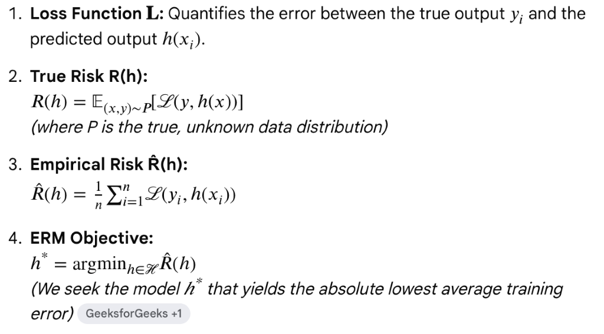

---

## GD Variants
`image72.png`
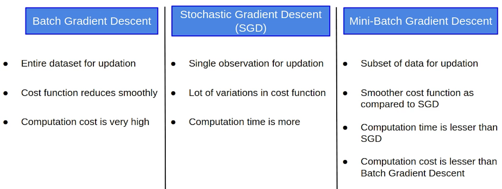

---

## SVM Objective + Hypothesis
`image74.png`
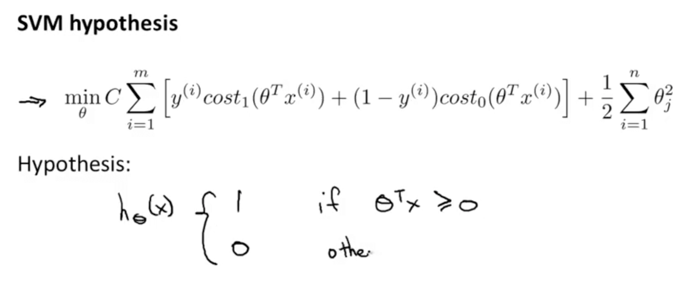

---

## Bayes Theorem (labeled)
`image75.png`

---

## Bayes Posterior Formula
`image76.png`
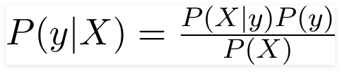

---

## Entropy Formula
`image78.png`
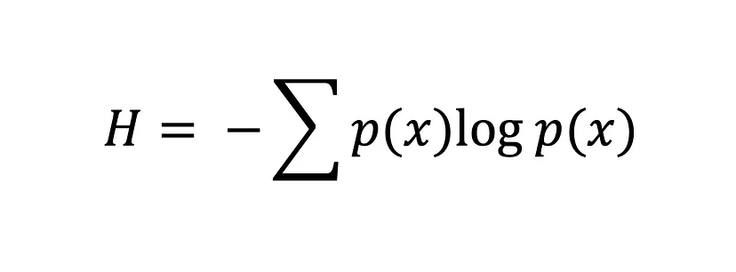

---

## RBF Kernel Formula
`image82.jpg`
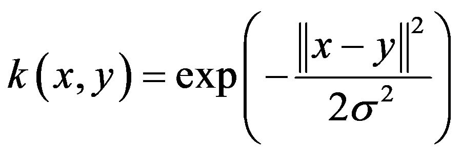

---

## Softmax → Cross-Entropy Block
`image85.png`
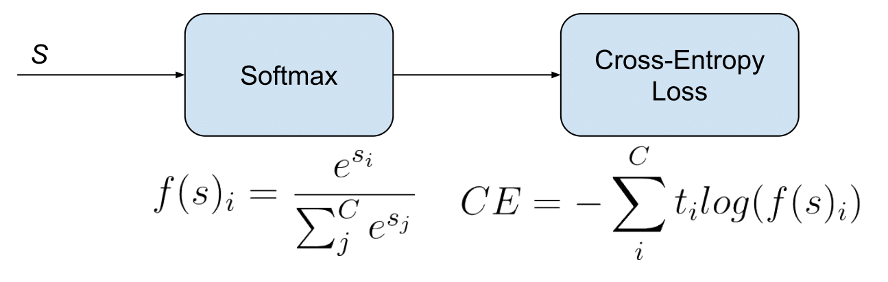

---

## Batch Norm Formula
`image87.png`
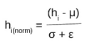
